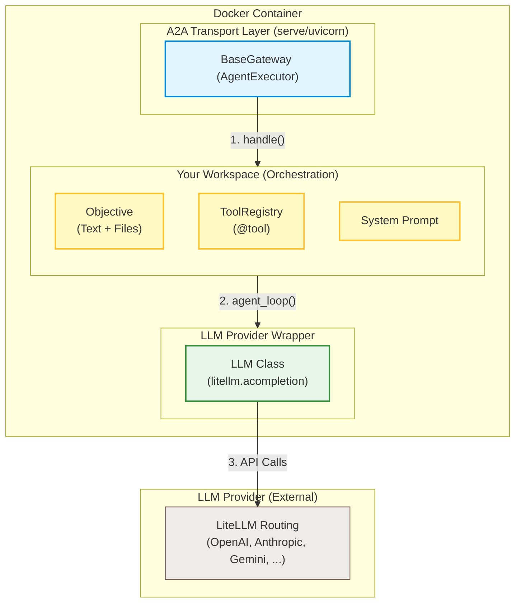
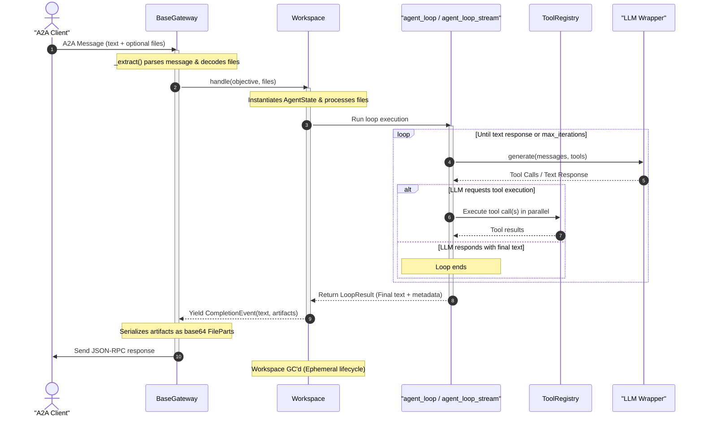

<p align="center">
  
</p>

<p align="center">
  <a href="https://pypi.org/project/lughus/"></a>
  <a href="https://pypi.org/project/lughus/"></a>
  <a href="https://opensource.org/licenses/MIT"></a>
</p>

# lughus

Micro-framework for building [A2A](https://google.github.io/A2A/) agents with [LiteLLM](https://github.com/BerriAI/litellm). No magic — a small, explicit codebase that replaces the orchestration framework layer.

---

## Why

Agent frameworks (LangChain, CrewAI, ADK, …) add layers of abstraction between your code and what's actually happening: node graphs, runners, session services, callbacks, stores. When something breaks, you debug the framework, not your logic.

`lughus` provides exactly what repeats from one agent to the next — and nothing more:

- **`agent_loop()`** — iterates LLM + tools until a text response, with parallel tool execution
- **`agent_loop_stream()`** — same, but yields text chunks as the LLM generates them
- **`ToolRegistry`** — a `@registry.tool()` decorator that registers Python functions (sync or async) as LLM tools
- **`BaseGateway`** — a generic A2A `AgentExecutor` (message extraction, artifact handling)
- **`LLM`** — a 25-line wrapper around `litellm.acompletion()`
- **`build_app()` / `serve()`** — A2A ASGI app construction + uvicorn wiring in one call

You write your tools, your prompts, and your orchestration logic. The framework handles the plumbing.

---

## Install

```bash
pip install lughus
```

Or for development (see [CONTRIBUTING.md](CONTRIBUTING.md) for details):

```bash
git clone https://github.com/hdg-zero/lughus.git
cd lughus
uv sync --all-extras --dev
.venv/bin/pre-commit install
```

---

## Create a new agent

Use the project scaffold when you want a production-ready starting point instead of wiring the
same files by hand:

```bash
lughus new agent_test
cd agent_test
python -m pip install -e ".[dev]"
pytest -q
python -m agent_test
```

This creates a full agent package with settings, tools, workspace orchestration, A2A gateway,
custom task store hook, ASGI entrypoint, `.env.example`, and offline tests using `MockLLM`.

You can customize the generated metadata in one command:

```bash
lughus new agent_test \
  --display-name "agent-test" \
  --description "Agent test." \
  --skill-id greet \
  --skill-name Greet
```

For prompts during generation:

```bash
lughus new agent_test --interactive
```

---

## Quickstart — minimal agent

A complete agent in 4 files:

### 1. `tools.py` — declare tools

```python
import json
from dataclasses import dataclass
from lughus import ToolRegistry

registry = ToolRegistry()

@dataclass
class AgentState:
    """Mutable state shared between tools."""
    result: str = ""

@registry.tool(
    "greet",
    "Greet the user by name.",
    {
        "type": "object",
        "properties": {
            "name": {"type": "string", "description": "Name to greet."},
        },
        "required": ["name"],
        "additionalProperties": False,
    },
)
def greet(*, name: str, state: AgentState) -> str:
    state.result = f"Hello {name}!"
    return json.dumps({"status": "success", "greeting": state.result})
```

Every tool receives `state=...` as a keyword argument (framework convention) plus whatever arguments the LLM provides.

### 2. `workspace.py` — orchestrate

```python
from lughus import agent_loop, ProgressEvent, CompletionEvent
from .tools import AgentState, registry

SYSTEM_PROMPT = "You are an assistant. Use the greet tool to greet the user."

class Workspace:
    def __init__(self, objective, llm):
        self.objective = objective
        self.llm = llm
        self.state = AgentState()

    async def run(self):
        yield ProgressEvent("Processing...")

        result = await agent_loop(
            self.llm,
            system=SYSTEM_PROMPT,
            context=self.objective,
            registry=registry,
            tool_names=["greet"],
            state=self.state,
        )

        yield CompletionEvent(text=result)
```

### 3. `gateway.py` — the A2A bridge

```python
from lughus import BaseGateway
from .workspace import Workspace

class MyGateway(BaseGateway):
    async def handle(self, objective, files):
        ws = Workspace(objective, self.llm)
        async for event in ws.run():
            yield event
```

That's it. `BaseGateway` handles A2A message extraction, artifact serialization, progress updates, and error handling.

### 4. `__main__.py` — launch

```python
from a2a.types import AgentCapabilities, AgentCard, AgentSkill
from lughus import LLM, BaseSettings, serve
from .gateway import MyGateway

settings = BaseSettings()

agent_card = AgentCard(
    name="my-agent",
    version="1.0.0",
    url=settings.public_url or f"http://{settings.host}:{settings.port}",
    description="My agent.",
    default_input_modes=["text/plain"],
    default_output_modes=["text/plain"],
    skills=[AgentSkill(id="greet", name="Greet", description="Greets the user.", tags=["demo"])],
    capabilities=AgentCapabilities(streaming=True),
)

llm = LLM.from_settings(settings)
gateway = MyGateway(llm=llm, settings=settings)

def main():
    serve(agent_card, gateway, settings.host, settings.port)

if __name__ == "__main__":
    main()
```

The server starts on `:8080` and exposes:
- `POST /` — A2A JSON-RPC endpoint
- `GET /.well-known/agent-card.json` — agent identity card
- `GET /health` and `GET /healthz` — health check (`{"status": "ok"}`)

---

## Architecture



*Note : Le Workspace et son état associé sont éphémères et détruits immédiatement après l'envoi de la réponse.*

### Request flow



---

## API reference

### `BaseSettings`

```python
from lughus import BaseSettings

@dataclass(frozen=True)
class Settings(BaseSettings):
    # Inherited fields:
    #   model: str             — "" (env AGENT_MODEL, required)
    #   max_output_tokens: int — 16384 (env MAX_OUTPUT_TOKENS)
    #   host: str              — "0.0.0.0" (env HOST)
    #   port: int              — 8080 (env PORT)
    #   public_url: str        — "" (env PUBLIC_URL)
    #   log_level: str         — "INFO" (env LOG_LEVEL)
    #   environment: str       — "development" (env LUGHUS_ENV)
    #   enable_test_ui: bool   — False (env ENABLE_TEST_UI)
    #   api_bearer_token: str  — "" (env API_BEARER_TOKEN)
    #   max_file_bytes: int    — 25 MB (env MAX_FILE_BYTES)
    #   max_http_body_bytes    — 80 MB (env MAX_HTTP_BODY_BYTES)
    #   max_objective_chars    — 100000 (env MAX_OBJECTIVE_CHARS)
    #   max_artifacts: int     — 10 (env MAX_ARTIFACTS)
    #   max_artifact_bytes     — 50 MB (env MAX_ARTIFACT_BYTES)
    #   max_total_artifact_bytes — 100 MB (env MAX_TOTAL_ARTIFACT_BYTES)
    #   max_concurrent_requests — 0/off (env MAX_CONCURRENT_REQUESTS)
    #   max_queue_backlog     — 0 (env MAX_QUEUE_BACKLOG)
    #   request_queue_timeout  — 5.0s (env REQUEST_QUEUE_TIMEOUT)
    #   tool_queue_timeout     — 30.0s (env TOOL_QUEUE_TIMEOUT)
    #   max_source_chars: int  — 12000 (env MAX_SOURCE_CHARS)

    # Your agent-specific fields:
    my_setting: str = os.getenv("MY_SETTING", "default")
```

No side effects at import. No `.env` loading — that's your agent's responsibility.

> **Note** — `max_source_chars` is a **convention field**: the framework declares it
> in `BaseSettings` for consistency across agents, but does **not** enforce it
> automatically. Your workspace is responsible for applying this limit when extracting
> text from documents (e.g., truncating PDF content before passing it to the LLM).

### `LLM`

```python
from lughus import LLM

llm = LLM(model="openai/gpt-4o", max_output_tokens=16384)

# Direct call (rarely needed — agent_loop does this for you)
response = await llm.generate(
    messages=[{"role": "user", "content": "Hello"}],
    tools=[...],  # optional, OpenAI format
)
```

Thin wrapper around `litellm.acompletion()`. Supports all LiteLLM providers: OpenAI, Azure OpenAI, Anthropic, Google, Bedrock, Ollama, and [100+ more](https://docs.litellm.ai/docs/providers). Change the model via the `AGENT_MODEL` env var — no code change needed.

The `model` parameter is **required** — passing an empty string raises a clear `ValueError` with instructions. This catches misconfiguration at startup rather than on the first LLM call.

Methods:
- `generate(messages=..., tools=...)` → `ModelResponse` (non-streaming)
- `astream(messages=..., tools=...)` → async iterable of chunks (streaming, with `stream_options` fallback for providers that don't support usage reporting)

#### Retry on transient errors

`LLM` automatically retries on transient errors (like `RateLimitError (429)`, `ServiceUnavailableError (503)`, `APIConnectionError`, and LLM call timeouts) with exponential backoff.

You can configure retry behavior through `BaseSettings` and pass it directly:

```python
llm = LLM.from_settings(settings)
```

Set `max_retries=0` to disable retries. Set `retry_base_delay=0.0` in test environments.
For streaming, Lughus retries both stream creation and chunk consumption. Since text chunks are buffered per iteration and only yielded to the client once the generation is complete, Lughus can safely retry the entire stream generation iteration if a transient connection error occurs midway.

### `ToolRegistry`

```python
from lughus import ToolRegistry

registry = ToolRegistry()

# Sync tool
@registry.tool("my_tool", "Description for the LLM.", {
    "type": "object",
    "properties": {
        "param1": {"type": "string", "description": "..."},
    },
    "required": ["param1"],
    "additionalProperties": False,
})
def my_tool(*, param1: str, state) -> str:
    return {"status": "success", "result": "..."}

# Async tool — same decorator, just use async def
@registry.tool("fetch_data", "Fetch data from an external API.", {
    "type": "object",
    "properties": {
        "url": {"type": "string", "description": "URL to fetch."},
    },
    "required": ["url"],
    "additionalProperties": False,
})
async def fetch_data(*, url: str, state) -> str:
    async with aiohttp.ClientSession() as session:
        async with session.get(url) as resp:
            data = await resp.text()
    return {"status": "success", "data": data[:1000]}
```

**Isolated per instance** — each agent creates its own `ToolRegistry()`. No pollution when multiple agents run in the same process.

Both sync and async tools are supported. The framework detects async functions automatically via `inspect.iscoroutinefunction()`. Tool names must be unique, and each tool must accept `state=...` as a keyword argument. Tools may return strings or JSON-serializable values; non-string values are serialized before being sent back to the LLM.

#### Sync vs async tools

Both `def` and `async def` tools are supported transparently.
Sync tools are offloaded to a background runner, so short blocking work does not
freeze the event loop. For network calls, database queries, subprocesses, or any
operation that may hang past `TOOL_TIMEOUT`, prefer `async def` tools or set
timeouts in the underlying client: Python cannot forcibly stop a sync thread
that is already blocked in external I/O.

```python
# Sync tool with short blocking I/O — runs outside the event loop
@registry.tool("read_file", "Read a local file.", {...})
def read_file(*, path: str, state) -> str:
    with open(path) as f:
        return json.dumps({"content": f.read()})

# Async tool — use when you want to await inside
@registry.tool("fetch_url", "Fetch a URL.", {...})
async def fetch_url(*, url: str, state) -> str:
    async with aiohttp.ClientSession() as s:
        async with s.get(url) as r:
            return json.dumps({"body": await r.text()})
```

Methods:
- `registry.declarations(["tool1", "tool2"])` → list of OpenAI-format dicts
- `registry.get_fn("tool1")` → the Python callable

### `agent_loop()`

```python
from lughus import ToolExecutionConfig, agent_loop

result = await agent_loop(
    llm,                              # LLM instance
    system="You are an assistant...", # system prompt
    context="The user request",       # first user message
    registry=registry,                # tool registry
    tool_names=["tool1", "tool2"],    # accessible tools
    state=my_state,                   # optional state object (passed to tools)
    max_iterations=50,                # safety limit (default: 50)
    tool_config=ToolExecutionConfig(
        max_parallel_tools=8,          # per-iteration tool concurrency
        max_global_tools=64,           # worker-local tool concurrency
        max_sync_thread_workers=32,     # worker pool for sync tools
        tool_timeout=120.0,            # per-tool timeout in seconds
        max_tool_args_chars=20_000,    # raw tool-call arguments limit
        max_tool_output_chars=20_000,  # tool response size limit
        max_message_history_chars=200_000,  # accumulated message history limit
    ),
)
# result is a str — the LLM's final text response
```

**This is the entire orchestration framework.** The loop:
1. Sends `system` + `context` + tool declarations to the LLM
2. If the LLM requests tool(s) → executes them with bounded parallelism, appends results
3. If the LLM responds with text → returns the response
4. Repeats until text response or `max_iterations`

When the LLM requests multiple tool calls in a single response, they run concurrently up to `ToolExecutionConfig.max_parallel_tools` and also respect the worker-local `max_global_tools` limit. Tool schemas are validated at registration time, LLM-provided arguments are validated before execution, and tool failures are returned as structured JSON with an `error_type`. Unknown names in `tool_names` raise `ToolValidationError` before the first LLM call so misconfigured agents fail early.

Call `agent_loop()` as many times as needed in your workspace — once per "phase" (planning, execution, verification, …), with different prompts and tools.

#### Usage metadata (`LoopResult`)

`agent_loop()` returns a `LoopResult` — a `str` subclass with attached metrics. It behaves exactly like a regular string (pass it to `CompletionEvent(text=...)`, `json.loads()`, etc.), but also exposes:

```python
result = await agent_loop(...)

result.iterations        # number of LLM round-trips
result.elapsed           # wall-clock seconds
result.prompt_tokens     # total input tokens across all iterations
result.completion_tokens # total output tokens across all iterations
result.total_tokens      # prompt_tokens + completion_tokens
result.cached_tokens     # prompt cache hits (OpenAI, Anthropic, etc.)
result.uncached_prompt_tokens # prompt_tokens - cached_tokens
```

These are also recorded as OpenTelemetry span attributes on the `agent_loop` span.

#### Token cost and tool schemas

`agent_loop()` sends the selected tool declarations on every LLM round-trip, along with the system prompt, user context, and accumulated tool-call history. This can make `prompt_tokens` look high for agents with many tools, but providers with prompt caching may bill cached input tokens at a lower rate. When comparing approaches, look at `uncached_prompt_tokens + completion_tokens`, not only `total_tokens`.

For agents with many verbose tools, `ToolExecutionConfig(compact_tool_schemas=True)` strips JSON Schema parameter descriptions from tool declarations while keeping names, types, enums, and required fields. This reduces repeated prompt size. A dynamic "tool registry query" pattern can reduce raw prompt even further, but it often adds extra LLM round-trips and may reduce prefix-cache stability. The trade-off is intentional: if your LLM provider does not support prompt caching, or if cache hit rates are low, you should explicitly consider a dynamic registry or tool-shortlisting phase for large tool surfaces.

`LoopResult` survives `copy.copy()`, `copy.deepcopy()`, and `pickle` round-trips. Note that `str(result)` returns a plain `str` without metadata — this is standard Python behavior for `str` subclasses.

### `agent_loop_stream()`

Streaming variant of `agent_loop()` — same signature, but yields text chunks as the LLM generates them:

```python
from lughus import agent_loop_stream, LoopResult

async for chunk in agent_loop_stream(
    llm,
    system="You are an assistant...",
    context="The user request",
    registry=registry,
    tool_names=["tool1", "tool2"],
    state=my_state,
):
    if isinstance(chunk, LoopResult):
        # Last yield — carries usage metadata (.iterations, .elapsed, etc.)
        final_text = chunk
    else:
        # Live text chunk from the LLM
        print(chunk, end="", flush=True)
```

During tool-calling iterations, text chunks (if any) are yielded as progress. On the final text response, chunks stream live. The **last** yielded value is always a `LoopResult`.

#### Streaming in a workspace

```python
from lughus import agent_loop_stream, LoopResult, ProgressEvent, CompletionEvent

class Workspace:
    async def run(self):
        result = None
        async for chunk in agent_loop_stream(self.llm, system=..., ...):
            if isinstance(chunk, LoopResult):
                result = chunk
            else:
                yield ProgressEvent(chunk)
        yield CompletionEvent(text=result, artifacts=[...])
```

Each text chunk becomes an A2A progress update — the user sees the response appear as the LLM types.

### `BaseGateway`

```python
from lughus import BaseGateway, ProgressEvent, CompletionEvent, Artifact

class MyGateway(BaseGateway):
    # self.llm and self.settings are available (passed to constructor)

    async def handle(self, objective, files):
        # objective: str — the A2A message text
        # files: list[(bytes, mime_type, filename)]

        yield ProgressEvent("Step 1...")

        # ... your logic ...

        yield CompletionEvent(
            text="Done!",
            artifacts=[
                Artifact(data=pdf_bytes, mime_type="application/pdf", name="report.pdf"),
            ],
        )
```

`BaseGateway` handles:
- **Extraction** of the A2A message (`_extract()`): text + binary files (base64 decoded)
- **Progress**: each `ProgressEvent` updates the A2A task status
- **Artifacts**: each `Artifact` in `CompletionEvent` is base64-encoded and sent as an A2A `FilePart`
- **Errors**: exceptions are caught and returned as A2A errors

#### File naming protocol

When an A2A client sends a file without a meaningful name (e.g. a generic upload ID),
it can precede the `FilePart` with a `TextPart` containing:

```
__ORIGINAL_FILENAME__:my_document.xlsx
```

`BaseGateway._extract()` intercepts this prefix and uses it as the file name in the
`files` list. This `TextPart` is **not** added to the objective text.

Uploaded filenames are sanitized to their basename before they reach your agent code:
`../../secret.txt` becomes `secret.txt`.

This is a client-side convention — your agent does not need to handle it explicitly.

### `build_app()` / `serve()`

```python
from lughus import build_app, serve

serve(agent_card, gateway, host="0.0.0.0", port=8080, log_level="INFO")

# Or integrate the ASGI app yourself:
app = build_app(agent_card, gateway, task_store=my_task_store)
```

`build_app()` wires `AgentCard` + `BaseGateway` + `DefaultRequestHandler` + `A2AStarletteApplication` and returns a Starlette-compatible ASGI app. `serve()` is the quickstart wrapper that calls `build_app()` and starts uvicorn. Both add `/health` and `/healthz` endpoints for container orchestrators (Cloud Run, Kubernetes, etc.).

#### Local Test UI

Enable the minimal browser UI for local agent runs:

```bash
export ENABLE_TEST_UI=true
python -m my_agent
```

Then open `http://localhost:8080/ui`. The UI sends an objective and optional files to
`gateway.handle()`, streams progress/tool/completion events live over `/ui/stream`,
traces tool calls with arguments, duration, status, and output, and exposes returned artifacts as downloads.

> [!WARNING]
> La console de test locale est **strictement conçue comme un outil de développement et de débogage rapide**. Elle ne doit en aucun cas être exposée en production ni être utilisée comme une interface utilisateur client finale. C'est pourquoi elle est désactivée par défaut et bloquée par validation stricte si `LUGHUS_ENV=production`.

#### Custom Task Store & OpenTelemetry Control

You can customize `serve()` behavior using optional parameters:

```python
from lughus import BoundedInMemoryTaskStore, serve

serve(
    agent_card,
    gateway,
    host="0.0.0.0",
    port=8080,
    task_store=BoundedInMemoryTaskStore(),  # Or inject a persistent Redis/SQL TaskStore
    setup_otel=False,                # Skip automatic OTel configuration if already configured
    enable_test_ui=False,            # Keep the browser test UI disabled in production
)
```

> **Note — production storage**: `serve()` uses a bounded in-process store by default
> (`TASK_STORE_TTL_SECONDS`, `TASK_STORE_MAX_TASKS`). For multiple replicas or durable
> status lookup, inject a persistent `TaskStore` such as Redis or SQL.

### Events

```python
from lughus import ProgressEvent, CompletionEvent, Artifact

# Progress (shown as A2A "working" status)
yield ProgressEvent("Planning...")

# Completion (shown as A2A "completed" status + artifacts)
yield CompletionEvent(
    text="3 slides created.",
    artifacts=[
        Artifact(data=pptx_bytes, mime_type="application/...", name="deck.pptx"),
    ],
)
```

### Errors

Public framework errors are exported from the top-level package:

```python
from lughus import (
    LoopLimitError,
    ToolExecutionError,
    ToolTimeoutError,
    ToolValidationError,
)
```

Tool-call failures are returned to the LLM as structured JSON, for example:

```json
{"error": "Invalid arguments for tool 'search': 'query' is a required property", "error_type": "ToolValidationError"}
```

---

### Testing

`lughus` provides a dedicated `lughus.testing` module containing mocks to test your agents and workspaces offline without calling real LLM providers.

To use them:

```python
from lughus.testing import MockLLM, MockStreamingLLM
from lughus import ToolRegistry, agent_loop

async def test_my_agent():
    # Pass a list of simulated responses (either str for text, or lists of dict for tool calls)
    llm = MockLLM([
        [{"id": "call_1", "name": "greet", "arguments": {"name": "Test"}}],
        "Done.",
    ])
    
    registry = ToolRegistry()
    @registry.tool("greet", "Greet.", {"type": "object", "properties": {}})
    def greet(*, name: str, state) -> str:
        return f"Hello {name}!"
        
    result = await agent_loop(
        llm,
        system=".",
        context="Say hello",
        registry=registry,
        tool_names=["greet"],
        state=None,
    )
    assert result == "Done."
    assert len(llm.calls) == 2  # Verify two LLM roundtrips occurred
```

---

## Production Checklist

Before running your agent in a production environment, review the following configuration items:

### 1. Robustness & Retries
- **Transient Errors**: `LLM` automatically retries on `RateLimitError`, `ServiceUnavailableError`, `APIConnectionError`, and call timeouts.
- **Configuration**:
  - `LLM_MAX_RETRIES` (default `3`): Max retry attempts.
  - `LLM_RETRY_BASE_DELAY` (default `1.0`s): Base delay for exponential backoff with jitter.

### 2. Task Store & Memory
- The default `BoundedInMemoryTaskStore` evicts tasks by TTL and maximum count.
- For horizontally scaled deployments, inject a persistent `TaskStore` (e.g., Redis or SQL) via the `task_store` parameter of `serve()`.

### 2b. Public Surface
- Set `PUBLIC_URL` to the externally reachable agent URL; otherwise scaffolds fall back to `http://HOST:PORT`.
- Set `API_BEARER_TOKEN` to require `Authorization: Bearer ...` on non-health routes.
- Set `CORS_ORIGINS` to allow cross-origin browser requests, and `CORS_ALLOW_CREDENTIALS=true` if credentials are required (wildcard `*` origins are rejected when credentials are enabled).
- Use `MAX_HTTP_BODY_BYTES`, `MAX_OBJECTIVE_CHARS`, `MAX_ARTIFACTS`, `MAX_ARTIFACT_BYTES`, and `MAX_TOTAL_ARTIFACT_BYTES` to bound request and response payloads before exposing an agent publicly.
- Set `MAX_CONCURRENT_REQUESTS` to add per-worker backpressure; at most `MAX_QUEUE_BACKLOG` additional requests wait, and requests that wait longer than `REQUEST_QUEUE_TIMEOUT` receive `503`.
- Set `LUGHUS_ENV=production` to fail fast unless `PUBLIC_URL`, `API_BEARER_TOKEN`, and a custom persistent `task_store` (announcing `durable = True` capability) are configured and the test UI is disabled.

### 3. Timeouts
- **LLM Timeout**: `LLM_TIMEOUT` (default `120.0`s) limits individual LLM requests.
- **Agent Timeout**: `AGENT_TIMEOUT` (default `600.0`s) limits the entire duration of `BaseGateway.execute()`, preventing hung tasks from consuming workers indefinitely.

### 4. Telemetry
- Configure `OTEL_EXPORTER_OTLP_ENDPOINT` to export traces and metrics to your OpenTelemetry collector.
- Monitor the `lughus.tool.errors` counter to detect failing tools, and `lughus.loop.duration` to track performance.

### 5. Guarantees & Architecture
- See [docs/guarantees.md](docs/guarantees.md) for explicit guarantees and non-guarantees.
- See [docs/security/error-disclosure.md](docs/security/error-disclosure.md) for error redaction policies.
- Architecture decisions are recorded in [ADR-001](docs/architecture/ADR-001-compatibility.md), [ADR-002](docs/architecture/ADR-002-streaming.md), and [ADR-003](docs/architecture/ADR-003-runtime.md).

---

## Configuration

### Environment variables

All environment variables are parsed strictly at instantiation time: invalid types or out-of-range bounds raise a `ValueError` immediately at startup (fail-fast).

| Variable | Default | Description |
|---|---|---|
| `AGENT_MODEL` | *(required)* | LiteLLM model string (e.g. `openai/gpt-4o`, `azure/gpt-4o`, `anthropic/claude-sonnet-4-20250514`) |
| `MAX_OUTPUT_TOKENS` | `16384` | Max output tokens |
| `HOST` | `0.0.0.0` | Listen interface |
| `PORT` | `8080` | Listen port |
| `PUBLIC_URL` | *(not set)* | External AgentCard URL. If unset, generated agents use `http://HOST:PORT`. |
| `LOG_LEVEL` | `INFO` | Python log level (`DEBUG`, `INFO`, `WARNING`, `ERROR`) |
| `LUGHUS_ENV` | `development` | Set to `production` to enable strict startup validation. |
| `API_BEARER_TOKEN` | *(not set)* | Optional bearer token required on non-health HTTP routes. Supports comma-separated list of multiple tokens (e.g. `token1,token2`) for key rotation. |
| `CORS_ORIGINS` | *(not set)* | Optional comma-separated list of allowed CORS origins (e.g. `http://example.com,https://test.com`) or `*`. |
| `CORS_ALLOW_CREDENTIALS` | `false` | Enable credentials on CORS requests. Must be `false` if `CORS_ORIGINS` contains `*`. |
| `LUGHUS_TELEMETRY_CONSOLE` | *(not set)* | Set to `true` to enable Console OTel exporter if `OTEL_EXPORTER_OTLP_ENDPOINT` is unset. |
| `OTEL_EXPORTER_OTLP_ENDPOINT` | *(not set)* | OTLP gRPC endpoint (e.g. `http://localhost:4317`). No exporter (disabled) if unset unless `LUGHUS_TELEMETRY_CONSOLE` is enabled. |
| `MAX_HTTP_BODY_BYTES` | `83886080` (80 MB) | Max HTTP body bytes accepted before A2A parsing, including streamed/chunked bodies. |
| `MAX_CONCURRENT_REQUESTS` | `0` | Max active HTTP requests in one ASGI app instance. Set to 0 to disable. |
| `MAX_QUEUE_BACKLOG` | `0` | Max extra HTTP requests allowed to wait for a concurrency slot. |
| `REQUEST_QUEUE_TIMEOUT` | `5.0` | Seconds a request waits for a concurrency slot before receiving `503`. Set to 0 to fail immediately. |
| `MAX_FILE_BYTES` | `26214400` (25 MB) | Max size per uploaded file |
| `MAX_FILES` | `10` | Max number of uploaded files accepted per request |
| `MAX_REQUEST_BYTES` | `52428800` (50 MB) | Max total decoded file bytes accepted per request |
| `MAX_OBJECTIVE_CHARS` | `100000` | Max extracted objective text length. |
| `MAX_SOURCE_CHARS` | `12000` | Max chars extracted per source document |
| `MAX_ARTIFACTS` | `10` | Max artifacts accepted in one `CompletionEvent`. |
| `MAX_ARTIFACT_BYTES` | `52428800` (50 MB) | Max bytes per returned artifact before base64 encoding. |
| `MAX_TOTAL_ARTIFACT_BYTES` | `104857600` (100 MB) | Max total bytes across all artifacts in one completion before base64 encoding. |
| `LLM_TIMEOUT` | `120.0` | LLM call timeout in seconds. Set to 0 to disable. |
| `LLM_MAX_RETRIES` | `3` | Max retries on transient LLM errors. Set to 0 to disable. |
| `LLM_RETRY_BASE_DELAY` | `1.0` | Base delay in seconds for exponential backoff between retries. |
| `LLM_RETRY_MAX_ELAPSED` | `0.0` | Total retry sleep budget in seconds, shared across one `agent_loop()` invocation. Set to 0 to disable. |
| `AGENT_TIMEOUT` | `600.0` | Total agent timeout in seconds (entire handle() call). Set to 0 to disable. |
| `MAX_PARALLEL_TOOLS` | `8` | Max tool calls executed concurrently within one loop iteration. |
| `MAX_GLOBAL_TOOLS` | `64` | Max tool calls executed concurrently in one event loop / worker process. |
| `MAX_SYNC_THREAD_WORKERS` | `32` | Max worker threads used for synchronous tools and framework blocking work. |
| `TOOL_TIMEOUT` | `120.0` | Per-tool timeout in seconds. Set to 0 to disable. |
| `TOOL_QUEUE_TIMEOUT` | `30.0` | Seconds a tool waits for a worker-local global tool slot before returning a structured timeout error. Set to 0 to fail immediately. |
| `MAX_TOOL_ARGS_CHARS` | `20000` | Max raw JSON argument characters accepted for one tool call. |
| `MAX_TOOL_OUTPUT_CHARS` | `20000` | Max characters accepted in one tool response before returning a structured error. |
| `MAX_MESSAGE_HISTORY_CHARS` | `200000` | Max serialized LLM message history characters before the loop stops. Set to 0 to disable. |
| `COMPACT_TOOL_SCHEMAS` | `false` | Strip JSON Schema parameter descriptions from tool declarations to reduce repeated prompt tokens. |

### Provider examples

```bash
# OpenAI
export AGENT_MODEL="openai/gpt-4o"
export OPENAI_API_KEY="sk-..."

# Azure OpenAI
export AGENT_MODEL="azure/gpt-4o"
export AZURE_API_KEY="..."
export AZURE_API_BASE="https://my-resource.openai.azure.com"
export AZURE_API_VERSION="2025-04-01-preview"

# Anthropic
export AGENT_MODEL="anthropic/claude-sonnet-4-20250514"
export ANTHROPIC_API_KEY="sk-ant-..."

# Google Gemini
export AGENT_MODEL="gemini/gemini-2.5-flash"
export GEMINI_API_KEY="..."

# Ollama (local)
export AGENT_MODEL="ollama/llama3.1"
```

No code change needed — LiteLLM routes automatically. See [LiteLLM providers](https://docs.litellm.ai/docs/providers) for the full list.

---

## Package structure

```
lughus/
    __init__.py      # Public API re-exports + __version__
    config.py        # BaseSettings dataclass
    llm.py           # LLM — litellm.acompletion() wrapper
    loop/            # Modular agent loop sub-package
    tools.py         # ToolRegistry + ToolDef
    gateway.py       # BaseGateway(AgentExecutor)
    events.py        # ProgressEvent, CompletionEvent, Artifact
    server.py        # build_app() + serve() — A2A + uvicorn
    ui_server.py     # Test UI routes template handler
    telemetry.py     # OpenTelemetry setup (traces + metrics)
    py.typed         # PEP 561 marker
```

14 source files, ~1000 lines total. You can read the entire framework in 15 minutes.

---

## Creating a new agent

To create a new agent, structure your project with the following standard layout:

```
my_agent/
    __init__.py
    __main__.py          # AgentCard + serve()  →  python -m my_agent
    config.py            # class Settings(BaseSettings): ...
    gateway.py           # class MyGateway(BaseGateway): handle()
    workspace.py         # Your orchestration + agent_loop()
    tools.py             # registry = ToolRegistry(); @registry.tool(...)
    prompt.py            # Your system prompts
    requirements.txt     # lughus + your deps
```

### Checklist

1. **`tools.py`** — Create a `ToolRegistry()`, define your `AgentState`, register tools with `@registry.tool()`
2. **`prompt.py`** — Write your system prompts (one per phase if multi-phase)
3. **`workspace.py`** — Implement `run()` as an `AsyncIterator` that yields `ProgressEvent` / `CompletionEvent`, calling `agent_loop()` for each phase
4. **`gateway.py`** — Subclass `BaseGateway`, implement `handle()` (3 lines: create workspace, yield its events)
5. **`config.py`** — Subclass `BaseSettings` if you have custom fields
6. **`__main__.py`** — Define the `AgentCard`, instantiate `LLM` + gateway, call `serve()`

### Docker

```dockerfile
FROM python:3.13-slim
WORKDIR /app
COPY my_agent/ ./my_agent/
RUN pip install --no-cache-dir -r my_agent/requirements.txt
EXPOSE 8080
HEALTHCHECK CMD python -c "import urllib.request; urllib.request.urlopen('http://localhost:8080/health')"
CMD ["python", "-m", "my_agent"]
```

---

## Session independence

Each A2A request is fully isolated:

1. **No shared state.** Your `handle()` method creates a fresh workspace (state, tools, context) for every request. Nothing leaks between requests — no class-level caches, no global dicts, no session stores.

2. **Ephemeral lifecycle.** The workspace lives for the duration of the request. When `handle()` returns (or raises), the workspace and all its data are garbage-collected. Files, intermediate results, LLM message history — everything is destroyed.

3. **Request-local gateway state.** `BaseGateway` keeps only configuration plus an in-process map of running task IDs so local cancellation can stop active coroutines. Your workspace state remains request-local.

```
Request A ──→ Workspace A (state, tools, messages) ──→ Response A ──→ GC'd
Request B ──→ Workspace B (state, tools, messages) ──→ Response B ──→ GC'd
                          ↑ no shared state ↑
```

This means:
- **Horizontal scaling is straightforward for stateless requests** — run N replicas and inject a persistent `TaskStore` for durable task status.
- **No memory leaks** — each request cleans up after itself.
- **No concurrency bugs** — no shared mutable state between requests.

If you need multi-turn sessions, add a persistent session store with TTL cleanup. A local `dict[session_id, state]` is fine for development, but it is not enough for multiple replicas.

---

## Observability (OpenTelemetry)

lughus instruments every request with native [OpenTelemetry](https://opentelemetry.io/) traces and metrics. No logging calls — everything flows through OTel spans and counters.

### Traces

Every A2A request produces a trace with the following span hierarchy:

```
a2a.request                        ← root span (gateway)
  └─ agent_loop                    ← one per agent_loop() call
       ├─ llm.generate             ← one per LLM round-trip
       ├─ tool.list_layouts        ← one per tool execution
       ├─ llm.generate
       ├─ tool.build
       └─ llm.generate             ← final text response
```

#### Span attributes

| Span | Attributes |
|---|---|
| `a2a.request` | `lughus.objective_len`, `lughus.file_count`, `lughus.status` |
| `agent_loop` | `gen_ai.request.model`, `lughus.max_iterations`, `lughus.iterations`, `lughus.elapsed_s`, `gen_ai.usage.*` |
| `llm.generate` | `gen_ai.request.model`, `lughus.iteration`, `gen_ai.usage.prompt_tokens`, `gen_ai.usage.completion_tokens`, `gen_ai.usage.cached_tokens` |
| `tool.{name}` | `tool.name` |

### Metrics

| Metric | Type | Description |
|---|---|---|
| `lughus.loop.tokens` | Counter | LLM tokens consumed (attributes: `token.type`, `gen_ai.request.model`) |
| `lughus.loop.duration` | Histogram | Agent loop wall-clock duration in seconds |
| `lughus.tool.errors` | Counter | Tool execution errors (attribute: `tool.name`) |

### Exporters

The exporter is chosen automatically at startup:

| `OTEL_EXPORTER_OTLP_ENDPOINT` | Behavior |
|---|---|
| Set (e.g. `http://localhost:4317`) | OTLP gRPC export to the collector (Jaeger, Grafana Tempo, etc.) |
| Not set | Console exporter (spans printed to stdout — useful in dev) |

### Setup

`serve()` calls `setup_telemetry()` automatically. For manual setup (tests, scripts):

```python
from lughus import setup_telemetry

setup_telemetry("my-agent")
```

### Accessing metrics programmatically

`agent_loop()` returns a `LoopResult` (a `str` subclass) with attached metrics:

```python
result = await agent_loop(llm, system=..., context=..., registry=registry,
                          tool_names=["my_tool"], state=state)

print(f"Took {result.elapsed:.1f}s, {result.total_tokens} tokens")
# Took 6.8s, 3412 tokens
```

### Quick start with Jaeger

```bash
# Start Jaeger (OTLP on 4317, UI on 16686)
docker run -d -p 16686:16686 -p 4317:4317 jaegertracing/all-in-one

# Point the agent at it
export OTEL_EXPORTER_OTLP_ENDPOINT=http://localhost:4317

python -m my_agent
# → traces visible at http://localhost:16686
```

---

## Conventions

- **Tools**: every function receives `state=...` as a keyword argument. The type of `state` is up to you — it's a dataclass defined by the agent.
- **Tool return values**: JSON-stringified (`json.dumps({...})`). The LLM reads this JSON to decide what to do next.
- **Events**: `ProgressEvent` for intermediate status, `CompletionEvent` for the end. `Artifact` objects in `CompletionEvent` are serialized as base64 A2A `FilePart`s.
- **No persistence**: each request creates an ephemeral workspace, destroyed after response. If you need multi-turn, add a session cache in your gateway.

---

## Philosophy

1. **The visible code is the real code.** No metaclasses, no magic decorators that rewrite your logic, no implicit graphs. `agent_loop()` is a `for` loop — open `loop/` and read it.

2. **The minimum that repeats, and nothing more.** The framework does what's identical across agents: call the LLM, execute tools, extract A2A messages, serialize artifacts. Your orchestration logic (which phases, in what order, with which prompts) stays in your code.

3. **Switch providers without changing code.** LiteLLM routes to 100+ providers. Your agent is written once, deployed anywhere.

4. **No persistence by default.** A workspace lives for the duration of a request. If you need sessions, add them — it's your code, not a framework plugin.

---

## License

MIT — see [LICENSE](LICENSE).
