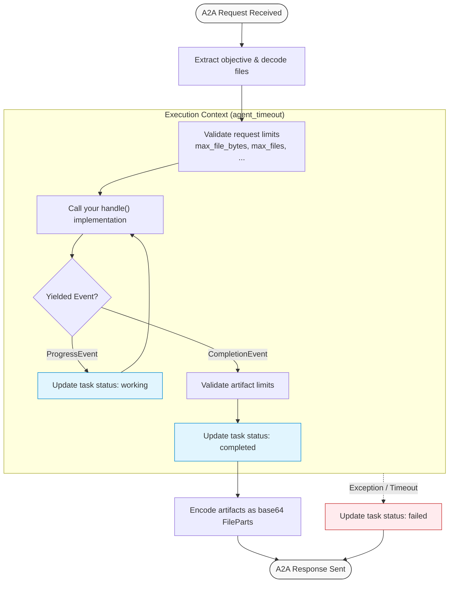

# Gateway API

The `gateway` module handles interfacing with the A2A request-response lifecycle.



## `BaseGateway`

Abstract base class for building an A2A agent executor.

```python
class BaseGateway(AgentExecutor):
    def __init__(self, llm: LLM, settings: BaseSettings):
```

### Methods to Implement

#### `handle`

Abstract method where the agent logic is implemented. Must yield progress or completion events.

```python
async def handle(
    self,
    objective: str,
    files: list[tuple[bytes, str, str]],
) -> AsyncIterator[ProgressEvent | CompletionEvent]:
```

*   `objective`: Objective text extracted from the A2A message.
*   `files`: List of tuples containing `(file_bytes, mime_type, filename)`.

`handle()` must yield exactly one `CompletionEvent` for a successful request. If it returns without a completion, `BaseGateway.execute()` marks the task as failed so A2A clients do not remain stuck in a non-terminal working state. Additional events emitted after completion are ignored with a warning.

### File Extraction Limits

`BaseGateway._extract()` applies the common file safety limits from `BaseSettings`:

*   `MAX_FILE_BYTES`: maximum decoded bytes per file.
*   `MAX_FILES`: maximum number of accepted files per request.
*   `MAX_REQUEST_BYTES`: maximum total decoded file bytes per request.
*   `MAX_OBJECTIVE_CHARS`: maximum extracted objective text length.

Base64 file payloads are validated strictly. Accepted filenames are sanitized to their basename before being handed to agent code, so path components such as `../../secret.txt` become `secret.txt`. Invalid or oversized files are skipped with a `WARNING` log entry.

### Artifact Limits

Before `CompletionEvent` artifacts are base64-encoded, `BaseGateway.execute()` applies:

*   `MAX_ARTIFACTS`: maximum artifact count in one completion.
*   `MAX_ARTIFACT_BYTES`: maximum bytes per artifact.
*   `MAX_TOTAL_ARTIFACT_BYTES`: maximum total bytes across all artifacts.

Violations fail the A2A task with a clear error instead of attempting to serialize an oversized response.

---

## Events & Data Classes

### `ProgressEvent`

Yielded to update the task status in the A2A client with intermediate working logs.

```python
class ProgressEvent:
    def __init__(self, text: str):
        self.text = text
```

### `CompletionEvent`

Yielded to mark the task as complete and attach output text and artifacts.

```python
class CompletionEvent:
    def __init__(self, text: str, artifacts: list[Artifact] | None = None):
        self.text = text
        self.artifacts = artifacts or []
```

### `Artifact`

Represents binary outputs or files generated by the agent.

```python
class Artifact:
    def __init__(self, data: bytes, mime_type: str, name: str):
        self.data = data
        self.mime_type = mime_type
        self.name = name
```
