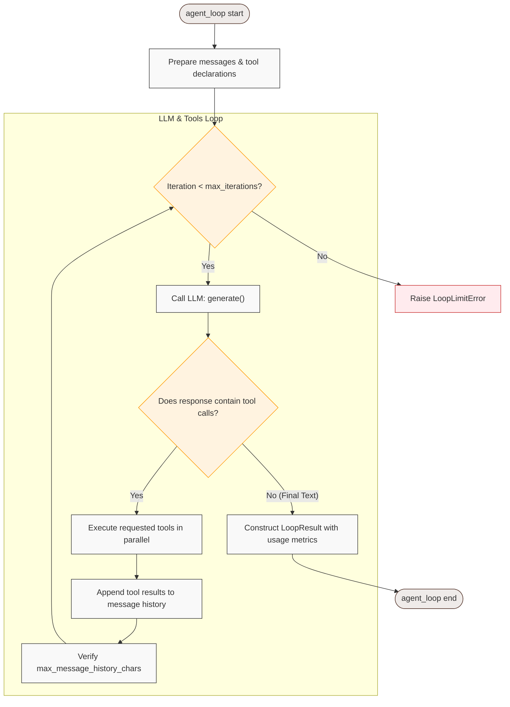

# Loop Module API

The `loop` module contains the orchestrator functions that run the LLM tool-calling cycle.



## `agent_loop`

Runs a synchronous/non-streaming agent loop.

```python
async def agent_loop(
    llm: GenerateLLM,
    *,
    system: str,
    context: str,
    registry: ToolRegistry,
    tool_names: list[str],
    state: Any = None,
    max_iterations: int = 50,
    tool_config: ToolExecutionConfig | None = None,
) -> LoopResult:
```

### Parameters
*   `llm`: The [LLM](llm.md) wrapper instance.
*   `system`: The system prompt instructing the agent on its role and rules.
*   `context`: The user prompt or task objective.
*   `registry`: The [ToolRegistry](tools.md) instance containing declared tools.
*   `tool_names`: The list of tool names that the LLM is allowed to call.
*   `state`: Optional state object passed to tools during execution.
*   `max_iterations`: Maximum number of tool-calling iterations before raising a `RuntimeError`.
*   `tool_config`: Optional `ToolExecutionConfig` controlling per-iteration tool concurrency and per-tool timeout.

### Returns
Returns a `LoopResult` (a subclass of `str`) containing the final LLM text response and metadata attributes:
*   `.iterations`: Total iterations performed.
*   `.prompt_tokens`: Total input tokens consumed.
*   `.completion_tokens`: Total output tokens consumed.
*   `.total_tokens`: Total tokens consumed.
*   `.cached_tokens`: Input tokens retrieved from provider caches.
*   `.elapsed`: Execution time in seconds.

---

## `agent_loop_stream`

Runs a streaming agent loop, yielding content deltas as they arrive.

```python
async def agent_loop_stream(
    llm: StreamingLLM,
    *,
    system: str,
    context: str,
    registry: ToolRegistry,
    tool_names: list[str],
    state: Any = None,
    max_iterations: int = 50,
    tool_config: ToolExecutionConfig | None = None,
) -> AsyncGenerator[str | LoopResult, None]:
```

### Parameters
*   Same as `agent_loop`.

### Yields
*   `str`: Deltas of the final text response generated by the LLM in the last iteration. Text emitted in earlier iterations that also request tool calls is kept in message history but is not streamed to callers as final output.
*   `LoopResult`: The final result containing metadata. This is always the **last** yielded value.

---

## `LoopResult`

Represents the output of the agent loop. It inherits from `str`, allowing you to treat it as a regular string while accessing metadata.

```python
class LoopResult(str):
    @property
    def iterations(self) -> int: ...
    @property
    def prompt_tokens(self) -> int: ...
    @property
    def completion_tokens(self) -> int: ...
    @property
    def total_tokens(self) -> int: ...
    @property
    def cached_tokens(self) -> int: ...
    @property
    def elapsed(self) -> float: ...
```

---

## `ToolExecutionConfig`

Controls runtime guardrails for tool calls.

```python
class ToolExecutionConfig:
    max_parallel_tools: int = 8
    max_global_tools: int = 64
    max_sync_thread_workers: int = 32
    tool_timeout: float | None = None
    tool_queue_timeout: float | None = 30.0
    max_tool_args_chars: int = 20_000
    max_tool_output_chars: int = 20_000
    max_message_history_chars: int = 200_000
```

*   `max_parallel_tools`: Maximum tool calls executed concurrently within one loop iteration.
*   `max_global_tools`: Maximum tool calls executed concurrently in the current event loop / worker process. Use `0` to disable this limit.
*   `max_sync_thread_workers`: Maximum worker threads used for synchronous tools.
*   `tool_timeout`: Per-tool timeout in seconds. Use `None` or `0` to disable.
*   `tool_queue_timeout`: Maximum seconds a tool waits for a worker-local global tool slot before returning a structured `ToolTimeoutError`. Use `None` to wait indefinitely or `0` to fail immediately.
*   `max_tool_args_chars`: Maximum raw JSON argument characters accepted for one tool call.
*   `max_tool_output_chars`: Maximum characters accepted in one tool response.
*   `max_message_history_chars`: Maximum serialized LLM message history characters before the loop raises `LoopLimitError`. Use `0` to disable.

Tool errors are returned as structured JSON containing `error` and `error_type`. Loop iteration exhaustion raises `LoopLimitError`, which is both a `LughusError` and a `RuntimeError`.
