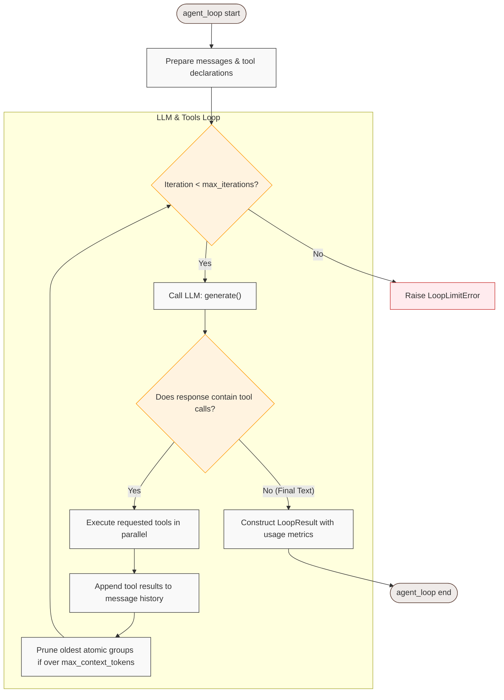

> [← Documentation index](../index.md)

# Loop Module API

The `loop` module contains the orchestrator functions that run the LLM tool-calling cycle.


```mermaid
flowchart TD
    %% Styling
    classDef process fill:#f9f9f9,stroke:#333,stroke-width:1px;
    classDef dec fill:#fff3e0,stroke:#ff9800,stroke-width:1px;
    classDef endnode fill:#efebe9,stroke:#5d4037,stroke-width:1px;
    classDef error fill:#ffebee,stroke:#c62828,stroke-width:1px;
    
    Start([agent_loop start]) --> Prep[Prepare messages & tool declarations]
    Prep --> LoopStart{Iteration < max_iterations?}
    
    subgraph ExecutionLoop["LLM & Tools Loop"]
        LoopStart -->|Yes| LLMCall["Call LLM: generate()"]
        LLMCall --> ResponseType{Does response contain tool calls?}
        
        ResponseType -->|Yes| ParallelExec[Execute requested tools in parallel]
        ParallelExec --> AppendMsg[Append tool results to message history]
        AppendMsg --> CheckBudget[Prune oldest atomic groups if over max_context_tokens]
        CheckBudget --> LoopStart
        
        ResponseType -->|"No (Final Text)"| Finalize[Construct LoopResult with usage metrics]
    end
    
    LoopStart -->|No| MaxExceeded[Raise LoopLimitError]
    Finalize --> End([agent_loop end])

    class Prep,LLMCall,ParallelExec,AppendMsg,CheckBudget,Finalize process;
    class LoopStart,ResponseType dec;
    class Start,End endnode;
    class MaxExceeded error;
```

## `agent_loop`

Runs a synchronous/non-streaming agent loop.

```python
async def agent_loop(
    llm: GenerateLLM,
    *,
    system: str,
    context: str,
    registry: ToolRegistry,
    tool_names: list[str],
    state: Any = None,
    max_iterations: int = 12,
    tool_config: ToolExecutionConfig | None = None,
    context_items: Sequence[ContextItem] = (),
) -> LoopResult:
```

### Parameters
*   `llm`: The [LLM](llm.md) wrapper instance.
*   `system`: The system prompt instructing the agent on its role and rules.
*   `context`: The user prompt or task objective.
*   `registry`: The [ToolRegistry](tools.md) instance containing declared tools.
*   `tool_names`: The list of tool names that the LLM is allowed to call.
*   `state`: Optional state object passed to tools during execution.
*   `max_iterations`: Maximum number of tool-calling iterations before raising `LoopLimitError` (default: `12`).
*   `tool_config`: Optional `ToolExecutionConfig` controlling per-iteration tool concurrency and per-tool timeout.
*   `context_items`: Optional provenance-tracked context items rendered before the user objective inside the cacheable prefix.

### Returns
Returns a `LoopResult` (a subclass of `str`) containing the final LLM text response and metadata attributes:
*   `.iterations`: Total iterations performed.
*   `.prompt_tokens`: Total input tokens consumed.
*   `.completion_tokens`: Total output tokens consumed.
*   `.total_tokens`: Total tokens consumed.
*   `.cached_tokens`: Input tokens retrieved from provider caches.
*   `.elapsed`: Execution time in seconds.

---

## `agent_loop_stream`

Runs a streaming agent loop, yielding content chunks as they arrive.

```python
async def agent_loop_stream(
    llm: StreamingLLM,
    *,
    system: str,
    context: str,
    registry: ToolRegistry,
    tool_names: list[str],
    state: Any = None,
    max_iterations: int = 12,
    tool_config: ToolExecutionConfig | None = None,
    streaming_mode: str | StreamingMode = StreamingMode.BUFFERED,
    context_items: Sequence[ContextItem] = (),
) -> AsyncGenerator[StreamChunk | LoopResult, None]:
```

### Parameters
*   Same as `agent_loop`, plus:
*   `streaming_mode`: `"buffered"` (default) yields text only once the full response is available; `"live"` yields each `delta.content` chunk as it arrives from the provider. See the [Streaming Contract](../contracts/streaming.md).

### Yields
*   `StreamChunk`: Content chunks of the final text response generated by the LLM in the last iteration (`chunk.content`). In `buffered` mode they are emitted after the response completes; in `live` mode as each delta arrives. Text emitted in earlier iterations that also request tool calls is kept in message history but is not streamed to callers as final output.
*   `LoopResult`: The final result containing metadata. This is always the **last** yielded value. Distinguish it from provisional chunks with `isinstance(value, LoopResult)` or `value.final`.

---

## `LoopResult`

Represents the output of the agent loop. It inherits from `str`, allowing you to treat it as a regular string while accessing metadata.

```python
class LoopResult(str):
    @property
    def iterations(self) -> int: ...
    @property
    def prompt_tokens(self) -> int: ...
    @property
    def completion_tokens(self) -> int: ...
    @property
    def total_tokens(self) -> int: ...
    @property
    def cached_tokens(self) -> int: ...
    @property
    def elapsed(self) -> float: ...
```

---

## `ToolExecutionConfig`

Controls runtime guardrails for tool calls. The object is inert: constructing it allocates nothing; the loop creates and closes an implicit `ExecutionRuntime` when `runtime` is `None`.

```python
@dataclass(frozen=True)
class ToolExecutionConfig:
    max_parallel_tools: int = 4
    max_global_tools: int = 64
    max_sync_thread_workers: int = 32
    tool_timeout: float | None = 30.0
    max_tool_args_chars: int = 20_000
    max_tool_output_chars: int = 8_192
    max_context_tokens: int = 8_192
    tool_queue_timeout: float | None = 30.0
    runtime: ExecutionRuntime | None = None
    policy: ToolPolicy | None = None
    principal: Principal | None = None
    approval_store: ApprovalStore | None = None
    idempotency_store: IdempotencyStore | None = None
    budget: BudgetLedger | None = None
    run_id: str = "untracked"
    artifact_projection: bool = False
    artifact_projection_threshold: int = 4_096
```

*   `max_parallel_tools`: Maximum tool calls executed concurrently within one loop iteration.
*   `max_global_tools`: Runtime capacity used when the loop creates an implicit runtime.
*   `max_sync_thread_workers`: Worker threads used for synchronous tools.
*   `tool_timeout`: Per-tool timeout in seconds. Use `None` or `<= 0` to disable.
*   `max_tool_args_chars`: Maximum raw JSON argument characters accepted for one tool call.
*   `max_tool_output_chars`: Maximum characters accepted in one tool response before truncation or artifact projection.
*   `max_context_tokens`: Estimated-token budget for the message history. Oldest atomic groups are pruned when exceeded; the prefix (system, context items, user objective) is never pruned.
*   `tool_queue_timeout`: Maximum seconds a tool waits for a global tool slot before returning a structured `ToolTimeoutError`. Use `None` to wait indefinitely or `0` to fail immediately.
*   `runtime`: Optional injected `ExecutionRuntime`. When `None`, the loop builds and closes its own.
*   `policy` / `principal`: Optional `ToolPolicy` evaluator enforcing pre-dispatch authorization rules; a `principal` is required when `policy` is set.
*   `approval_store` / `idempotency_store`: Optional governance stores for human-in-the-loop approvals and exactly-once execution receipts.
*   `budget`: Optional `BudgetLedger` reserving/settling one `tool_calls=1` amount per dispatch.
*   `run_id`: Unique run identifier tracking execution context.
*   `artifact_projection` / `artifact_projection_threshold`: When enabled, oversized tool outputs are stored whole in an `ArtifactStore` and replaced by a summary plus a `fetch_artifact` reference instead of being truncated.

Tool errors are returned as structured JSON containing `error` and `error_type`. Loop iteration exhaustion raises `LoopLimitError`, which is both a `LughusError` and a `RuntimeError`.

---

## A2A exchange events

When a tool delegates to a remote A2A agent, it can emit console events describing the exact exchange. Both functions are exported from `lughus` (and `lughus.loop`) and write to the same sink as `collect_tool_events`, so they surface automatically in the developer console and in A2A working-status streams.

```python
from lughus import emit_a2a_request, emit_a2a_response

emit_a2a_request(
    target_agent="research_agent",
    url="http://localhost:9001",
    method="message/send",          # default
    objective="Survey recent RAG papers",
    files=[(raw_bytes, mime, name)],  # optional attached files
)

emit_a2a_response(
    target_agent="research_agent",
    url="http://localhost:9001",
    status="ok",                    # or "error"
    text="<full response text>",
    artifacts=[(data_bytes, mime, name)],  # base64-encoded for UI downloads
    remote_task_id="task_42",
    error_code=None,                # e.g. "DELEGATION_TIMEOUT"
    elapsed_ms=1234.5,
)
```

Event payloads seen by consumers:

- `a2a_request`: `type`, `tool_name`, `target_agent`, `url`, `method`, `objective`, `file_count`, `files` (name/mime/size per file).
- `a2a_response`: `type`, `tool_name`, `target_agent`, `url`, `status`, `text`, `artifacts` (`name` / `mime_type` / `data_base64`), `remote_task_id`, `error_code`, `elapsed_ms`.

The developer console renders these as dedicated cards (request: purple, response: cyan) with downloadable artifact links and an "A2A" filter button; see [Server API](server.md). For a complete delegation example see [A2A Delegation](../integrations/a2a-delegation.md).

**Related:** [Server API](server.md) · [A2A Delegation](../integrations/a2a-delegation.md)
