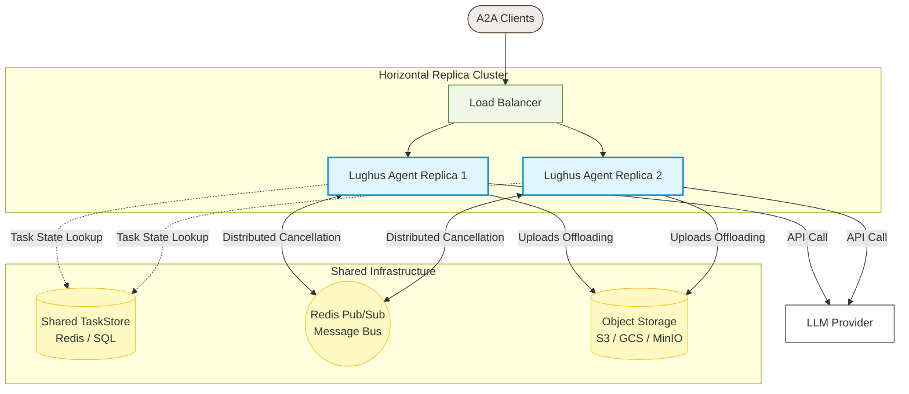

# Production Deployment Guide

Before deploying your `lughus` agent to a production environment, ensure you review the following checklist to maintain reliability, observability, and efficient resource limits.

## 1. Resilience & Retries

Production LLM endpoints frequently suffer from temporary outages, network fluctuations, or rate limits (`HTTP 429` / `HTTP 503`).
*   **Automatic Retries**: `LLM` automatically retries on `RateLimitError`, `ServiceUnavailableError`, and `APIConnectionError` with exponential backoff.
*   **Max Retries Configuration**: Set `LLM_MAX_RETRIES` (default: `3`) to increase or decrease the attempt ceiling.
*   **Base Delay Configuration**: Set `LLM_RETRY_BASE_DELAY` (default: `1.0` seconds) to control the initial backoff delay. Retries use jitter unless the provider supplies `Retry-After`.
*   **Retry Budget**: Set `LLM_RETRY_MAX_ELAPSED` to cap the total retry sleep budget. The default `0` disables the budget.

## 2. Hard Limits & Timeouts

Protect your worker threads from hanging indefinitely or processing malicious requests.
*   **Individual LLM Timeout**: Set `LLM_TIMEOUT` (default: `120.0` seconds) to limit the time a single `acompletion()` or `astream()` call can take.
*   **Global Execution Timeout**: Set `AGENT_TIMEOUT` (default: `600.0` seconds) to enforce a hard ceiling on the entire execution loop inside `BaseGateway.execute()`. This prevents loops or slow tools from blocking Uvicorn workers permanently.
*   **Tool Concurrency Limit**: Set `MAX_PARALLEL_TOOLS` (default: `8`) to bound the number of tool calls executed concurrently within one loop iteration.
*   **Global Tool Concurrency Limit**: Set `MAX_GLOBAL_TOOLS` (default: `64`) to bound tool calls across one event loop / worker process.
*   **Global Tool Queue Timeout**: Set `TOOL_QUEUE_TIMEOUT` (default: `30.0` seconds) to bound how long a tool waits for a worker-local global tool slot before returning a structured timeout error.
*   **Sync Worker Pool Limit**: Set `MAX_SYNC_THREAD_WORKERS` (default: `32`) to bound the process-wide pool used by synchronous tools and framework blocking work.
*   **Tool Timeout**: Set `TOOL_TIMEOUT` (default: `120.0` seconds) to prevent a single slow tool from holding a loop indefinitely. Set to `0` to disable. A timeout cannot forcibly terminate a synchronous Python thread that is already blocked in external I/O, so long-running network, database, or subprocess tools should be async or use their own client-level timeouts.
*   **Tool Payload Limits**: Set `MAX_TOOL_ARGS_CHARS` and `MAX_TOOL_OUTPUT_CHARS` (defaults: `20000`) to protect message history from tool-call payload blowups.
*   **Message History Limit**: Set `MAX_MESSAGE_HISTORY_CHARS` (default: `200000`) to stop runaway loops before they exceed a model context window or create unexpected token cost.
*   **File Upload Limits**: Set `MAX_FILE_BYTES` (default: `26214400` / 25 MB), `MAX_FILES` (default: `10`), and `MAX_REQUEST_BYTES` (default: `52428800` / 50 MB) to bound per-file size, file count, and total decoded upload bytes.
*   **HTTP Body Limit**: Set `MAX_HTTP_BODY_BYTES` (default: `83886080` / 80 MB) to reject oversized requests before A2A parsing, including streamed/chunked bodies without `Content-Length`.
*   **Request Backpressure**: Set `MAX_CONCURRENT_REQUESTS` (default: `0`, disabled) to bound active HTTP requests per ASGI app instance. Set `MAX_QUEUE_BACKLOG` (default: `0`) to bound how many additional requests may wait. Requests that exceed the backlog or wait longer than `REQUEST_QUEUE_TIMEOUT` (default: `5.0` seconds) receive `503`.
*   **Objective Limit**: Set `MAX_OBJECTIVE_CHARS` (default: `100000`) to reject very large extracted objective text.
*   **Artifact Limits**: Set `MAX_ARTIFACTS` (default: `10`), `MAX_ARTIFACT_BYTES` (default: `52428800` / 50 MB), and `MAX_TOTAL_ARTIFACT_BYTES` (default: `104857600` / 100 MB) to bound response payloads before base64 encoding.

## 3. Public Access Guard

`build_app()` installs a small production guard middleware:
*   **Health routes remain open**: `/health` and `/healthz` are not authenticated.
*   **Bearer auth**: Set `API_BEARER_TOKEN` to require `Authorization: Bearer <token>` on other routes. Multiple tokens can be configured using a comma-separated list (e.g. `token1,token2`) to support timing-safe key rotation. Leave it empty only behind a trusted gateway or during local development.
*   **CORS origins**: Set `CORS_ORIGINS` to a comma-separated list of allowed origins (e.g. `http://example.com,https://test.com`) or `*` to enable cross-origin browser requests.
*   **External URL**: Set `PUBLIC_URL` so generated `AgentCard.url` values point to the public endpoint instead of `http://0.0.0.0:8080`.
*   **Strict Production Mode**: Set `LUGHUS_ENV=production` to fail startup unless `API_BEARER_TOKEN`, `PUBLIC_URL`, and a custom persistent `task_store` are configured and the test UI is disabled.

## 4. Persistent Task Storage

By default, `build_app()` / `serve()` initialize the A2A app with `BoundedInMemoryTaskStore`.
*   **Bounded Local Memory**: The default store evicts tasks by `TASK_STORE_TTL_SECONDS` (default: `86400`) and `TASK_STORE_MAX_TASKS` (default: `10000`) to avoid unlimited memory growth in single-process deployments.
*   **Redis or DB Task Store**: The bounded store is still process-local. For horizontal scaling, implement the `TaskStore` protocol from the `a2a` SDK and inject your custom persistent store using the `task_store` parameter in `build_app()` or `serve()` to store states externally. Local cancellation also only stops tasks running in the current process.

## 5. Telemetry & Monitoring

Lughus exports standard traces and metrics using OpenTelemetry.
*   **Collector Endpoint**: Set `OTEL_EXPORTER_OTLP_ENDPOINT` (e.g. `http://otel-collector:4317`) to route telemetry data.
*   **Console Exporter**: Set `LUGHUS_TELEMETRY_CONSOLE=true` to view telemetry outputs in console logs. It is disabled by default to keep logs clean in production.
*   **Traces**: View trace graphs of the core loop and individual tool call execution steps.
*   **Key Observability Metrics**:
    *   `lughus.tool.errors` (Counter): Monitor spikes in this counter to detect failing tools.
    *   `lughus.loop.duration` (Histogram): Monitor P95 or P99 latency of the agentic loop.

## 6. High-Volume Scalability & File Offloading

When scaling to thousands of concurrent users, memory exhaustion and distributed state coordination become critical concerns.

### Memory Exhaustion (OOM) Protection
By default, Lughus decodes base64 file attachments directly into memory as `bytes`. Under high concurrency, large uploads can easily trigger Out-Of-Memory (OOM) crashes of the worker processes.
*   **Offloading Uploads:** In your gateway, avoid keeping the raw `bytes` in memory. Stream or write the decoded bytes immediately to temporary disk files (using `tempfile.NamedTemporaryFile`) or offload them directly to an object storage service (e.g. AWS S3, Google Cloud Storage, or MinIO). Pass the file path or URI to the agent workspace instead of the raw data.
*   **Tighten Constraints:** Keep `MAX_FILE_BYTES` (default: 25 MB) and `MAX_REQUEST_BYTES` (default: 50 MB) tuned to the smallest values your agent actually needs.

### Distributed State & Clustering
Deploying multiple container replicas behind a load balancer requires a centralized coordinator.
*   **Custom Persistent TaskStore:** Always implement a custom `TaskStore` backed by a shared datastore (e.g., Redis or a relational database) and pass it to `build_app(..., task_store=custom_store)`. This ensures task state and status lookups are consistent across all cluster instances.
*   **Distributed Cancellation:** The default `BaseGateway.cancel()` terminates the asyncio task locally. In a clustered environment, you should publish cancellation events to a distributed message bus (e.g. Redis Pub/Sub) so the replica currently running the task can intercept it and abort execution.

