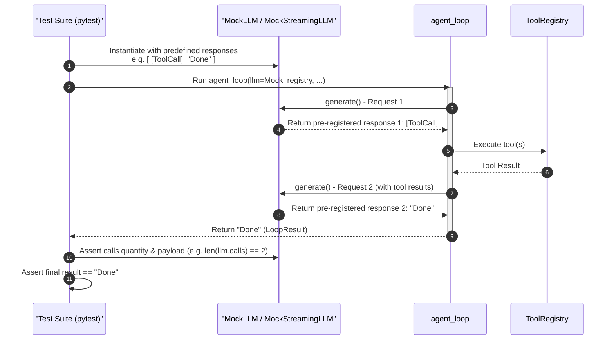

# Testing Guide

`lughus` comes with a public, opt-in testing utilities module `lughus.testing` to help agent authors build fast, deterministic unit tests without network dependency or LLM API usage.



## Available Mocks

### `MockLLM`

Used to mock non-streaming LLM responses. You supply a list of simulated responses, where:
*   A `str` represents a plain text answer.
*   A `list[dict]` represents one or more tool calls.

#### Example

```python
from lughus.testing import MockLLM
from lughus import ToolRegistry, agent_loop

async def test_my_agent():
    # Sequence of two LLM turns: first calls tool 'greet', second returns text
    llm = MockLLM([
        [{"id": "call_1", "name": "greet", "arguments": {"name": "Alice"}}],
        "Done greeting Alice."
    ])

    registry = ToolRegistry()
    @registry.tool("greet", "Greet.", {"type": "object", "properties": {"name": {"type": "string"}}})
    def greet(*, name: str, state) -> str:
        return f"Hello {name}!"

    result = await agent_loop(
        llm,
        system="Role prompt",
        context="Greet Alice",
        registry=registry,
        tool_names=["greet"],
    )

    assert result == "Done greeting Alice."
    # Verify exact parameters sent to LLM during execution
    assert len(llm.calls) == 2
    assert llm.calls[0]["messages"][-1]["content"] == "Greet Alice"
```

---

### `MockStreamingLLM`

Used to mock streaming LLM responses. Works identically to `MockLLM` but returns async generators simulating chunked response deltas and token usage metadata.

#### Example

```python
from lughus.testing import MockStreamingLLM
from lughus import ToolRegistry, agent_loop_stream

async def test_my_streaming_agent():
    llm = MockStreamingLLM(["Hello word-by-word!"])
    registry = ToolRegistry()

    chunks = []
    async for chunk in agent_loop_stream(
        llm,
        system=".",
        context="Hi",
        registry=registry,
        tool_names=[],
    ):
        chunks.append(chunk)

    # Yields text chunks, with the last yielded item being a LoopResult containing metadata
    assert len(chunks) > 1
    assert chunks[-1].iterations == 1
    assert chunks[-1].prompt_tokens == 10
```
