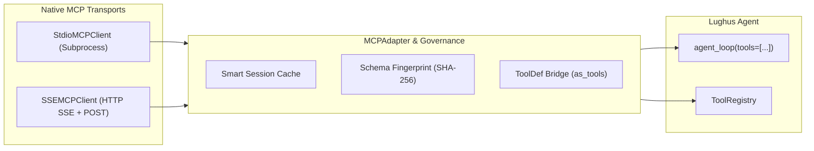

> [← Documentation index](../index.md)

# MCP Integration Guide

The Model Context Protocol (MCP) allows Lughus agents to dynamically interact with external, standardized tool servers. Our integration is designed to be policy-ready, high-performance, and secure by default.

---

## Architecture

The integration follows an adapter and native transport architecture (`lughus.interfaces.mcp`):

- **`MCPClient` Protocol**: Defines standard tool discovery (`list_tools()`) and execution (`call_tool()`).
- **Native Transports**:
  - `StdioMCPClient`: Executes local MCP servers via subprocess standard I/O (stdin/stdout) using JSON-RPC 2.0.
  - `SSEMCPClient`: Connects to remote MCP servers using Server-Sent Events (SSE) streaming and HTTP POST dispatch via `httpx`.
- **`MCPAdapter`**: Wraps any client implementation, providing runtime constraint enforcement, smart session caching, and bridging MCP tool descriptors directly into Lughus's native `ToolDef` and governance pipeline.



---

## Native Transports

Lughus provides built-in, dependency-light transports for connecting to both local and remote MCP servers without requiring third-party SDKs.

### 1. Local Subprocess Transport (`StdioMCPClient`)

Use `StdioMCPClient` to spawn and communicate with a local MCP server process:

```python
import sys
from lughus.interfaces.mcp import MCPServerConfig, MCPAdapter, StdioMCPClient

# Spawn a local Python or Node.js MCP server
client = StdioMCPClient(
    command=[sys.executable, "-m", "my_mcp_server"],
    # Or command="npx -y @modelcontextprotocol/server-filesystem /tmp"
)

config = MCPServerConfig(
    origin="stdio://local/my_mcp_server",
    allowed_tools=frozenset(["read_file", "list_directory"]),
    cache_tools=True,
)

adapter = MCPAdapter(client, config)
```

`StdioMCPClient` supports:
- Automatic JSON-RPC 2.0 handshake (`initialize` / `notifications/initialized`).
- Asynchronous stdin/stdout streaming and non-blocking readline loop.
- Server-driven push notifications (`notifications/tools/list_changed`), automatically invalidating cached tool definitions.
- Async context management (`async with client: ...`) for clean process termination and signal handling (`SIGTERM` / `SIGKILL`).

### 2. Remote HTTP & SSE Transport (`SSEMCPClient`)

Use `SSEMCPClient` to interact with remote MCP servers over HTTP Server-Sent Events:

```python
from lughus.interfaces.mcp import MCPServerConfig, MCPAdapter, SSEMCPClient

client = SSEMCPClient(
    endpoint="https://mcp.internal.service/sse",
    headers={"Authorization": "Bearer s3cr3t-t0k3n"},
    timeout=30.0,
)

config = MCPServerConfig(
    origin="https://mcp.internal.service",
    allowed_tools=frozenset(["search_docs", "query_database"]),
    cache_tools=True,
)

adapter = MCPAdapter(client, config)
```

`SSEMCPClient` handles SSE endpoint discovery (`event: endpoint`), streaming event dispatch, and JSON-RPC HTTP POST requests with robust error extraction.

---

## Server Configuration (`MCPServerConfig`)

When connecting to an MCP server, configure security constraints and performance options via `MCPServerConfig`:

| Parameter | Type | Default | Description |
|:---|:---|:---|:---|
| `origin` | `str` | *Required* | Server origin. Must use `https://`, `http://` (local dev), or `stdio://`. |
| `allowed_tools` | `frozenset[str]` | *Required* | Explicit allowlist of tool names permitted for agent use. |
| `max_tools` | `int` | `100` | Maximum number of tools accepted from server discovery. |
| `max_output_characters` | `int` | `100_000` | Output size ceiling per tool invocation to prevent memory exhaustion. |
| `cache_tools` | `bool` | `True` | Session caching mode. When `True`, avoids redundant network roundtrips. |

---

## Smart Caching & Low Latency

In standard MCP implementations, calling a tool often triggers a redundant `list_tools()` network request to verify schema conformity before execution.

`MCPAdapter` eliminates this latency through **Smart Session Caching**:
- **Default caching (`cache_tools=True`)**: Tool descriptors are discovered once at startup (or on first invocation) and cached for the duration of the session. Invocations dispatch directly to `client.call_tool()` with zero extra network latency.
- **Event-Driven Invalidation**: If the server advertises schema modifications via `notifications/tools/list_changed`, the client automatically signals the adapter, which invalidates the cache and triggers a fresh snapshot on the next call.
- **Manual Invalidation**: Call `adapter.invalidate()` at any time to evict cached tools.
- **Strict Drift Verification (`cache_tools=False`)**: In environments requiring zero trust on every call, disabling caching forces re-verification of the SHA-256 schema fingerprint against the server on each invocation.

---

## ToolDef Bridge (`as_tools`)

You can convert approved MCP tools directly into native Lughus `ToolDef` instances and pass them straight into `agent_loop`:

```python
from lughus import agent_loop
from lughus.interfaces.mcp import MCPServerConfig, MCPAdapter, StdioMCPClient

client = StdioMCPClient("uvx mcp-server-git")
config = MCPServerConfig(
    origin="stdio://local/mcp-server-git",
    allowed_tools=frozenset(["git_status", "git_diff"]),
)
adapter = MCPAdapter(client, config)

async with client:
    # Convert approved MCP tools to native ToolDef objects
    tools = await adapter.as_tools(requires_approval=False)

    # Pass directly into the agent loop
    result = await agent_loop(
        llm,
        system="You are a git assistant.",
        context="Check the status of the repository.",
        tools=tools,
    )
```

Converted `ToolDef` instances:
- Do not require an artificial `state` argument (`takes_state=False`).
- Carry conservative governance metadata by default (`ToolEffect.EXTERNAL`, `ToolRisk.UNKNOWN`, `requires_approval=True`, `SERIAL_PER_TOOL`).
- Allow overriding metadata (e.g. `requires_approval=False`, custom `risk`) at conversion time.

You can also register tools into a `ToolRegistry` via `await adapter.register_tools(registry)`.

---

## Security & Governance

1. **Private Execution Endpoint (`_invoke`)**: All MCP executions route through the standard governance pipeline (policy, human approvals, idempotency guards, and budgets). Application code must not call `_invoke` directly.
2. **Untrusted Data Boundary**: All data returned from MCP servers is treated as untrusted external content.
3. **Origin Validation**: Remote endpoints must be well-formed origins without path injections or query parameters. Local subprocesses must use explicit `stdio://` origins.

---

**Related:** [Tools API](../api/tools.md) · [Tools Contract](../contracts/tools.md) · [Security: Threat Model](../security/threat-model.md)
