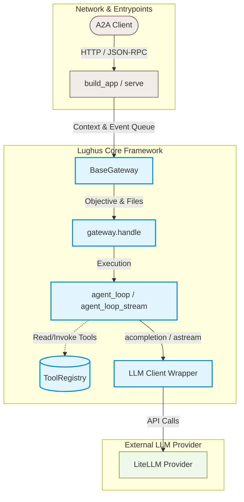

# Lughus Overview

`lughus` is a lightweight micro-framework designed to build **Agent-to-Agent (A2A)** agents using [LiteLLM](https://github.com/BerriAI/litellm). It provides:
1. An **Agentic Loop** supporting bounded parallel tool calling, per-tool timeouts, token accumulation, and response streaming.
2. A **Tool Registry** to easily declare and run tools.
3. An **A2A Gateway** to handle A2A protocol message parsing, file handling, progress tracking, and error reporting.
4. **Server helpers** (`build_app` / `serve`) to integrate or host the agent as an asynchronous web server.
5. A **CLI scaffold** (`lughus new`) to generate a complete agent project with tests and production-oriented configuration.

## Architecture

The framework consists of a few decoupled components:

- **[BaseGateway](api/gateway.md)**: Acts as the entrypoint for A2A requests. It decodes uploaded files, tracks task states (working, completed, failed), and sends progress updates and artifacts back to the caller.
- **[agent_loop / agent_loop_stream](api/loop.md)**: The core orchestration engine that runs the LLM call, processes requested tool calls with bounded parallelism, accumulates usage metrics, and returns the final answer.
- **[ToolRegistry](api/tools.md)**: Handles registration of synchronous and asynchronous tool functions, generates JSON schema declarations for the LLM, and executes functions safely.
- **[LLM](api/llm.md)**: A thin wrapper around LiteLLM that supports per-call timeouts and automatic retries with exponential backoff on transient provider errors.
- **[CLI](api/cli.md)**: Generates a ready-to-run agent architecture so new projects start with settings, gateway, tools, task store hook, ASGI entrypoint, and offline tests.
