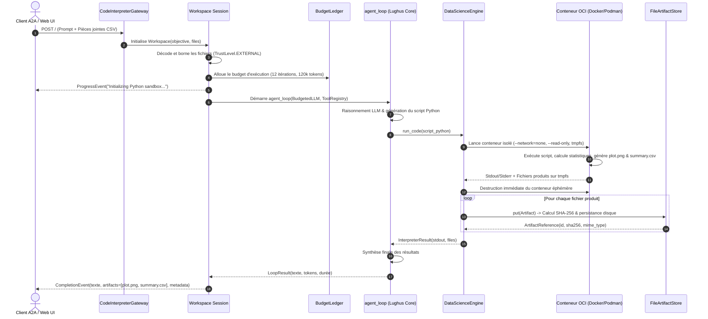

# 🔒 Sandboxed Code Interpreter Agent (Épisode 2)

> **Agent d'analyse de données et d'interprétation Python sous confinement OCI *Fail-Closed*.**  
> **Framework :** [Lughus v0.22.0](../../README.md) · **Protocole :** [A2A (Agent-to-Agent)](https://google.github.io/A2A/) sur le port `8082` · **Interface :** Developer Console `/ui`.

---

## 1. 🎯 Vision Globale & Périmètre Métier

### Description Macroscopique
L'exécution de code dynamique généré par un modèle de langage (LLM) est un vecteur d'amplification d'aptitudes incontournable pour la Data Science autonome : calculs statistiques vectorisés, modélisation prédictive, manipulation de gros volumes tabulaires et rendu graphique scientifique.  
Cependant, donner à un agent l'accès à un interpréteur Python non restreint expose l'infrastructure hôte à des **risques critiques majeurs** :
1. **L'exfiltration réseau et le rebond :** Le code généré peut scanner le réseau local (LAN), atteindre des services de métadonnées cloud (`169.254.169.254`) ou exfiltrer des clés d'API vers des serveurs de commande externes.
2. **L'altération et la compromission de l'hôte :** Lecture des variables d'environnement parentes, écriture ou suppression de fichiers système, fork-bombs ou épuisement de la mémoire RAM du serveur.
3. **L'injection indirecte de code (Prompt-to-Code Injection) :** Des pièces jointes ou jeux de données malveillants incitant le modèle à exécuter des charges hostiles (`os.system("rm -rf /")`).

Le **Sandboxed Code Interpreter Agent** résout ces menaces en appliquant une politique d'isolation absolue : le code généré ne s'exécute **que** dans une image de conteneur OCI (Docker ou Podman) **épinglée par son empreinte cryptographique immuable (digest SHA-256)**, sans aucun accès réseau, sous un utilisateur non-privilégié, avec un système de fichiers racine en lecture seule et des quotas matériels stricts.

### Use Cases Principaux
- 📊 **Analyse Exploratoire et Corrélations :** Traitement de jeux de données CSV/JSON volumineux, calculs de métriques de distribution, de corrélations de Pearson/Spearman et de moyennes pondérées.
- 📈 **Génération Graphique Haute Résolution :** Création et exportation de visualisations scientifiques (`.png`, `.svg`, `.pdf`) via un backend Matplotlib/Seaborn *headless* (`Agg`).
- 📁 **Production et Restitution d'Artefacts :** Synthèse de résultats tabulaires sous forme de nouveaux fichiers (`summary.csv`, classeurs Excel `.xlsx`) persistés et transférés via le protocole A2A.
- 🛡️ **Immunité aux Attaques Réseau & Injections :** Blocage matériel et immédiat de toute tentative d'ouverture de socket réseau ou de dérive de ressources.

### Matrice Scope & Out-of-Scope

| Fonctionnalité | Dans le Périmètre (In-Scope) | Hors Périmètre (Out-of-Scope) | Justification Architecturales |
| :--- | :---: | :---: | :--- |
| **Exécution Python** | ✅ Confinée en conteneur OCI | ❌ Directement sur l'hôte en prod | L'hôte ne doit jamais exécuter de code LLM non approuvé. |
| **Accès Réseau Sandbox** | ❌ Formellement interdit (`none`) | ✅ Téléchargement dynamique de packages | Pas de `pip install` à chaud ; l'image OCI doit contenir toutes les libs. |
| **Identification d'Image** | ✅ Digest SHA-256 obligatoire | ❌ Tags mutables (`:latest`) | Élimine les attaques par empoisonnement de registre ou dérive d'image. |
| **Gestion des Pannes** | ✅ Échec franc (*Fail-Closed*) | ❌ Repli silencieux vers l'hôte | Si le moteur Docker/Podman tombe, la requête échoue explicitement. |
| **Pièces Jointes Entrantes**| ✅ Texte UTF-8 borné (`EXTERNAL`) | ❌ Fichiers binaires arbitraires | Prévient les débordements de contexte et le prompt injection binaire. |
| **Rétention des Artefacts** | ✅ Fichiers indexés sur disque | ❌ Base de données blob distribuée | Conçu pour une exécution locale ou worker dédié stateless. |

---

## 2. 🏛️ Analyse Architecturale & Patterns

### Modèle Architectural Découplé
L'agent est conçu selon un patron en **4 couches étanches**, garantissant une séparation stricte entre le transport réseau, la session applicative, la gouvernance de ressources et l'exécution matérielle :

```
      ┌─────────────────────────────────────────────────────────────┐
      │                  1. Couche Transport A2A                    │
      │   CodeInterpreterGateway (FastAPI / ASGI / Starlette)       │
      │   Endpoints : JSON-RPC POST /  ·  SSE Stream  ·  /ui        │
      └──────────────────────────────┬──────────────────────────────┘
                                     │ (objective, bounded files)
                                     ▼
      ┌─────────────────────────────────────────────────────────────┐
      │                2. Couche Session & FinOps                   │
      │   Workspace (Request-Scoped)                                │
      │   ├── BudgetLedger & BudgetedLLM (Limites tokens / calls)   │
      │   └── ContextItem (Provenance TrustLevel.EXTERNAL)          │
      └──────────────────────────────┬──────────────────────────────┘
                                     │ agent_loop()
                                     ▼
      ┌─────────────────────────────────────────────────────────────┐
      │            3. Boucle Agent & Registre d'Outils              │
      │   ToolRegistry (Typage Pydantic, Docstrings Google)         │
      │   ├── code_interpreter (Exécution confinée)                │
      │   ├── get_sandbox_info (Inspection des quotas)              │
      │   └── get_environment_info (Sondage interne des packages)  │
      └──────────────────────────────┬──────────────────────────────┘
                                     │ execute(code)
                                     ▼
      ┌─────────────────────────────────────────────────────────────┐
      │          4. Moteur d'Exécution & Confinement OCI            │
      │   DataScienceEngine                                         │
      │   ├── ContainerPythonBackend (Docker / Podman --pull=never) │
      │   │   └── Montage tmpfs éphémère /workspace (64 MB)         │
      │   ├── IsolatedSubprocessBackend (Dev local / Tests offline) │
      │   └── FileArtifactStore (Persistance indexée SHA-256)       │
      └─────────────────────────────────────────────────────────────┘
```

### Diagramme de Séquence (Flux de Données d'une Requête)



### Arborescence Complète du Projet

```
examples/code_interpreter_agent/
├── code_interpreter_agent/
│   ├── __init__.py           # Package namespace et exports
│   ├── __main__.py           # Point d'entrée de service, AgentCard A2A & serveur ASGI
│   ├── config.py             # Settings validés (Pydantic / BaseSettings) et regex digest OCI
│   ├── engine.py             # DataScienceEngine, ContainerPythonBackend & IsolatedSubprocessBackend
│   ├── gateway.py            # CodeInterpreterGateway assurant l'interfaçage A2A
│   ├── py.typed              # Marqueur de typage statique strict PEP 561
│   ├── tools.py              # Registre d'outils typés (code_interpreter, sandbox_info)
│   └── workspace.py          # Session request-scoped, prompt système et injection de contexte
├── tests/
│   ├── test_engine.py        # Validation des bornes, du blocage réseau et de la capture d'artefacts
│   ├── test_tools.py         # Validation des métadonnées du ToolRegistry et de la sérialisation JSON
│   └── test_workspace.py     # Validation du budget, des pièces jointes et de la boucle via MockLLM
├── .env.example              # Gabarit exhaustif de configuration avec documentation des variables
├── pyproject.toml            # Déclaration des métadonnées, dépendances Data Science et scripts CLI
└── README.md                 # Documentation d'architecture logicielle de référence
```

---

## 3. 🗄️ Modélisation des Données & Persistance

### 1. Espaces d'Exécution Éphémères (In-Memory Tmpfs)
Pour éliminer tout risque de pollution croisée ou d'accumulation de fichiers entre deux requêtes :
- Le conteneur s'exécute avec un volume **`tmpfs` en mémoire vive** monté sur `/workspace` (`SANDBOX_WORKSPACE_MB=64`).
- Tout fichier créé par le script Python de l'agent est écrit dans ce volume éphémère.
- À la terminaison du conteneur, le volume `tmpfs` est intégralement détruit par le moteur OCI.

### 2. Magasin d'Artefacts Applicatifs (`FileArtifactStore`)
Les fichiers que l'agent choisit de restituer à l'utilisateur sont capturés à la volée avant la destruction du conteneur et confiés au `FileArtifactStore` :
- **Chemin de stockage :** `ARTIFACTS_DIR` (par défaut `./artifacts/<artifact_id>`).
- **Structure de l'entité `Artifact` :**
  ```python
  @dataclass(frozen=True)
  class Artifact:
      name: str          # Nom original (ex: 'anomalies_delais.png')
      data: bytes        # Contenu binaire brut
      mime_type: str     # Type MIME détecté (ex: 'image/png', 'text/csv')
  ```
- **Indexation et Intégrité :** Chaque artefact stocké génère une empreinte `SHA-256`, un identifiant unique `UUID4`, et est borné par les plafonds `SANDBOX_MAX_ARTIFACT_BYTES` (10 Mo) et `SANDBOX_MAX_FILES` (10 fichiers).

### 3. Modélisation du Contexte Externe
Les fichiers textuels envoyés par le client (CSV, JSON) sont convertis en instances de `ContextItem` :
```python
ContextItem(
    role="user",
    content=decoded_text[:MAX_ATTACHMENT_CHARS],
    source="attachment:data.csv",
    trust=TrustLevel.EXTERNAL,
    metadata={"mime_type": "text/csv", "truncated": False},
)
```
Le tag `TrustLevel.EXTERNAL` informe le moteur Lughus que ce contenu provient de l'extérieur et ne doit en aucun cas prévaloir sur le prompt système.

---

## 4. ⚡ Stack Technique Justifiée & Dépendances Clés

| Composant | Version | Rôle | Justification Technique |
| :--- | :---: | :--- | :--- |
| **`lughus`** | `^0.22.0` | Cœur du framework d'agents | Fournit la boucle `agent_loop`, `ContainerPythonBackend`, la gouvernance budgétaire et le serveur ASGI A2A. |
| **`fastapi` / `uvicorn`** | `*` | Serveur ASGI & Transport A2A | Performance asynchrone non-bloquante, support natif de SSE et documentation OpenAPI automatique. |
| **`pydantic`** | `^2.0` | Validation des données et schémas | Typage statique strict à l'exécution, génération automatique de schémas JSON Schema pour les outils LLM. |
| **`docker` / `podman`** | CLI | Moteur de conteneurisation OCI | Isolation standardisée au niveau noyau (cgroups, namespaces, seccomp). Support transparent de Docker et Podman. |
| **`pandas`** | `^2.0.0` | Manipulation de données tabulaires | Moteur de données standard de facto, ultra-rapide et vectorisé pour l'analyse analytique. |
| **`numpy`** | `^1.26.0` | Calcul numérique vectorisé | Fondement mathématique pour les statistiques descriptives et calculs matriciels. |
| **`matplotlib` & `seaborn`**| `^3.8` / `^0.13`| Rendu graphique scientifique | Génération de visualisations professionnelles riches. Exécuté en mode headless (`Agg`) pour zéro dépendance X11. |
| **`openpyxl`** | `^3.1.0` | Export de classeurs Excel | Permet à l'agent de manipuler et de produire des classeurs `.xlsx` pour les métiers. |
| **`pillow`** | `^10.0.0` | Traitement d'images | Validation et inspection des artefacts graphiques générés. |

---

## 5. 🛡️ Stratégie de Sécurité & Robustesse

### Les 7 Piliers du Confinement OCI Fail-Closed

```
 ┌────────────────────────────────────────────────────────────────────────┐
 │                      CONFINEMENT OCI FAIL-CLOSED                       │
 │                                                                        │
 │  1. Image Immuable :  image@sha256:<64 hex> (Rejet absolu des tags)   │
 │  2. Réseau Coupé   :  --network=none (Aucune socket entrante/sortante) │
 │  3. Privilège Zéro :  --user=65534:65534 (nobody/nogroup)              │
 │  4. FS Read-Only   :  --read-only (Racine protégée en écriture)        │
 │  5. Droits Linux   :  --cap-drop=ALL --security-opt=no-new-privileges  │
 │  6. Quotas Stricts :  CPU 1.0 · RAM 512MB · PIDs 64 · Tmpfs 64MB       │
 │  7. Zero Fallback  :  Pas de repli silencieux vers l'hôte en cas d'HS  │
 └────────────────────────────────────────────────────────────────────────┘
```

1. **Épinglage Cryptographique par Digest SHA-256 :**  
   L'image de conteneur doit obligatoirement être spécifiée sous la forme `registry/image@sha256:<hash>` (validée par expression régulière stricte dans `config.py`). Tout tag mutable (ex: `:latest`, `:v1`) est **rejeté dès l'initialisation**.
2. **Interdiction de Téléchargement à Chaud (`--pull=never`) :**  
   Lughus lance le conteneur avec l'argument `--pull=never`. L'image doit avoir été explicitement préchargée et auditée sur la machine hôte.
3. **Coupure Réseau Totale (`--network=none`) :**  
   Le conteneur ne dispose d'aucune interface réseau externe (uniquement loopback interne isolé). Toute commande tentant d'établir une connexion HTTP, SSH ou DNS échoue instantanément avec `Network is unreachable`.
4. **Moindre Privilège Utilisateur (`--user 65534:65534`) :**  
   Le processus Python tourne sous l'UID/GID de l'utilisateur non-privilégié `nobody` / `nogroup`. Même en cas d'évasion de l'interpréteur, le processus ne dispose d'aucun privilège `root`.
5. **Système de Fichiers en Lecture Seule & Sans Droits Supplémentaires :**  
   Le conteneur démarre avec `--read-only`, `--cap-drop=ALL` et `--security-opt=no-new-privileges`. Seul le répertoire `/workspace` en `tmpfs` est inscriptible.
6. **Quotas de Ressources Déterministes :**  
   - `SANDBOX_CPUS=1.0` : Empêche l'accaparement des cœurs du serveur hôte.
   - `SANDBOX_MEMORY_MB=512` : Limite mémoire stricte (OOM-killer ciblé sur le conteneur en cas d'excès).
   - `SANDBOX_PIDS_LIMIT=64` : Protection contre les attaques par fork-bomb.
7. **Refus de Repli Silencieux (*No Silent Fallback*) :**  
   Si le moteur Docker/Podman est arrêté ou indisponible, l'agent renvoie une erreur explicite `RuntimeError` et interrompt la requête. Il ne bascule **jamais** automatiquement sur l'hôte.

### Mode `subprocess` : Strictement Restreint au Dev & Tests
Le mode `SANDBOX_MODE=subprocess` utilise `python -I` (mode isolé de Python sans injection de `sys.path` ou variables d'environnement locales) et applique un blocage des sockets par monkey-patching ainsi que des limites POSIX `setrlimit`.  
Cependant, partageant l'UID du compte hôte, il ne constitue pas une barrière étanche face à du code malveillant. En conséquence :
```python
if self.environment.strip().lower() == "production" and self.sandbox_mode == SandboxMode.SUBPROCESS:
    raise ValueError("SANDBOX_MODE=subprocess is forbidden in production")
```

---

## 6. 🚨 Résilience, Gestion des Erreurs & Observabilité

### Double Niveau d'Échéance (*Timeouts*)
Pour garantir qu'aucun processus zombi ou conteneur orphelin ne subsiste :
- **Niveau 1 (`SANDBOX_TIMEOUT_S=45`) :** Échéance accordée à l'exécution interne du script. En cas de dépassement, le processus enfant reçoit un signal `SIGKILL`.
- **Niveau 2 (`TOOL_TIMEOUT=60`) :** Échéance globale Lughus englobant l'initialisation du conteneur, l'exécution, l'extraction des fichiers et le nettoyage. La règle `TOOL_TIMEOUT >= SANDBOX_TIMEOUT_S` est validée au démarrage.

### Caviardage des Erreurs & Protection contre les Fuites
Les exceptions levées lors du parsing ou de l'exécution interne ne divulguent aucun chemin absolu du serveur hôte, nom d'utilisateur système ou variable d'environnement. Les sorties d'erreur `stderr` sont nettoyées et plafonnées à `SANDBOX_MAX_OUTPUT_BYTES` (32 Ko).

### Télémétrie d'Exécution & Métadonnées
À chaque requête finalisée, le `CompletionEvent` renvoie des métadonnées exhaustives pour l'auditabilité et la facturation FinOps :
```json
{
  "artifact_count": 2,
  "budget_usage": {
    "model_calls": 2,
    "tool_calls": 3,
    "tokens": 4820
  },
  "cached_tokens": 1280,
  "elapsed_s": 8.412,
  "iterations": 2,
  "sandbox_mode": "container",
  "total_tokens": 6100
}
```

---

## 7. 🚀 Performance, Scalabilité & Caching

### 1. Vectorisation Native & Directives Système
Le prompt système de l'agent instruit explicitement le modèle à privilégier les opérations vectorisées (`pandas.Series.corr()`, opérations matricielles NumPy) plutôt que les boucles itératives Python (`for row in df.itertuples()`), divisant les temps de calcul par 50 sur des jeux de données d'entreprise.

### 2. Économie de Tokens & Caching Prompt
Lughus exploite le cache de préfixes des fournisseurs LLM (ex: Anthropic Prompt Caching, OpenAI Cached Tokens) en maintenant stables le prompt système et la déclaration des schémas d'outils. Les pièces jointes sont injectées de manière déterministe, maximisant le ratio de `cached_tokens` (visible dans les métadonnées de complétion).

### 3. I/O en Mémoire Vive
En écrivant et manipulant les graphiques sur un système de fichiers virtuel en RAM (`tmpfs`), l'agent évite les goulots d'étranglement d'I/O disque et garantit une génération quasi-instantanée des rendus visuels.

---

## 8. 🛠️ Guide de Démarrage & Standard de Qualité

### Prérequis Stricts
- **Python :** `>= 3.11`
- **Gestionnaire :** [`uv`](https://github.com/astral-sh/uv)
- **Moteur OCI :** Docker Engine ou Podman actif sur la machine.

---

### Étape 1 : Préparer et Épingler l'Image OCI

Créez une image contenant la suite Data Science ou utilisez une image de votre registre d'entreprise :

```dockerfile
# Dockerfile.datascience
FROM python:3.11-slim
RUN apt-get update && apt-get install -y --no-install-recommends \
    libfreetype6 libpng16-16 && rm -rf /var/lib/apt/lists/*
RUN pip install --no-cache-dir \
    pandas==2.2.2 numpy==1.26.4 matplotlib==3.8.4 seaborn==0.13.2 openpyxl==3.1.2 pillow==10.3.0 scipy==1.13.0
WORKDIR /workspace
USER nobody
```

Construisez l'image et récupérez son **digest SHA-256 immuable** :
```bash
docker build -t local/data-science:ep2 -f Dockerfile.datascience .
docker inspect --format='{{index .RepoDigests 0}}' local/data-science:ep2
# Exemple de sortie : local/data-science@sha256:d8a5f0b4c8... (64 hex chars)
```

---

### Étape 2 : Configuration de l'Agent (`.env`)

Dans le répertoire `examples/code_interpreter_agent/` :
```bash
cp .env.example .env
```

Éditez le fichier `.env` :
```bash
# Modèle LLM (via LiteLLM)
AGENT_MODEL="openai/gpt-4o"
OPENAI_API_KEY="sk-..."

# Paramètres Réseau & Console
PORT=8082
ENABLE_CONSOLE=true

# Paramètres Sandbox OCI Fail-Closed
SANDBOX_MODE="container"
CONTAINER_ENGINE="docker"
CONTAINER_IMAGE="local/data-science@sha256:votre_digest_hex_complet_ici"
```

> 💡 **Astuce Développement Local :** Pour tester rapidement l'agent sans conteneur local, vous pouvez positionner temporairement `SANDBOX_MODE=subprocess` (autorisé uniquement si `LUGHUS_ENV` n'est pas `production`).

---

### Étape 3 : Lancement du Serveur A2A

```bash
uv run --extra dev python -m code_interpreter_agent
```

Le serveur démarre immédiatement :
- 🖥️ **Developer Console :** Ouvrez [`http://127.0.0.1:8082/ui`](http://127.0.0.1:8082/ui) dans votre navigateur.
- 📜 **A2A Agent Card :** [`http://127.0.0.1:8082/.well-known/agent-card.json`](http://127.0.0.1:8082/.well-known/agent-card.json)
- 🔌 **Endpoint RPC A2A :** `POST http://127.0.0.1:8082/`

---

### Étape 4 : Démonstration Interactive (Scénario de l'Épisode 2)

Dans la console `/ui`, chargez un fichier CSV (par exemple `logistics_delays.csv`) et soumettez la requête suivante :

> *« Calcule la corrélation entre les retards de livraison et le taux d'incidents par hub logistique. Identifie les anomalies volumétriques, produis un graphique comparatif sauvegardé sous `retards_par_hub.png` et exporte le tableau récapitulatif sous `synthese_metriques.csv`. »*

L'agent va :
1. Déclarer le démarrage du sandbox via `ProgressEvent`.
2. Interroger `get_sandbox_info` pour vérifier ses quotas.
3. Écrire le code d'ingestion et de calcul statistique.
4. Exécuter le conteneur OCI et afficher en temps réel les sorties de calculs dans la console.
5. Capturer les deux artefacts (`retards_par_hub.png` et `synthese_metriques.csv`).
6. Restituer une réponse structurée avec prévisualisation immédiate du graphique et liens de téléchargement des artefacts.

---

### Étape 5 : Validation par la Suite de Tests Hors-Ligne

L'agent dispose d'une suite de tests complète, testable sans réseau ni conteneur grâce au backend de test et au `MockLLM` :

```bash
uv run --extra dev pytest tests -v
```

---

## 9. 🔮 Dette Technique & Vision Moyen Terme

### Limites Identifiées & Compromis Actuels
- **Partage du Noyau Linux (*Kernel Sharing*) :** Les conteneurs OCI (Docker/Podman) partagent le noyau de la machine hôte. Dans un contexte multi-tenant hautement hostile où des utilisateurs tiers injectent du code arbitraire, une vulnérabilité 0-day du noyau Linux pourrait théoriquement permettre une évasion.
- **Latence de Démarrage à Froid (*Cold Start*) :** L'instanciation d'un conteneur neuf à chaque exécution de script introduit une latence de 300 à 600 ms selon le système de stockage hôte.

### Roadmap d'Évolution
- [ ] **Isolation par MicroVMs Matérielles :** Intégration d'un backend [Firecracker](https://firecracker-microvm.github.io/) ou [gVisor](https://gvisor.dev/) (`runsc`) pour une isolation au niveau hyperviseur avec virtualisation matérielle dédiée.
- [ ] **Gestionnaire de Conteneurs Pré-Chauffés (*Warm Pool*) :** Maintien d'un pool de conteneurs initialisés en mémoire pour ramener le temps de démarrage à froid sous la barre des 50 ms.
- [ ] **Support Multi-Langages Sécurisé :** Extension du backend confiné à R (`Rscript`) et Julia pour les besoins spécifiques de la recherche académique et financière.
